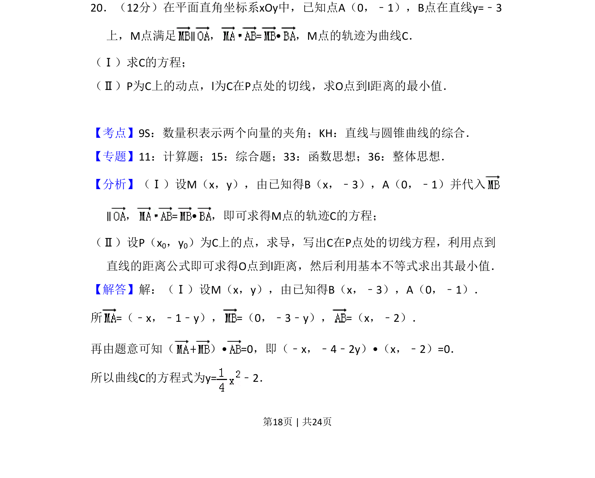
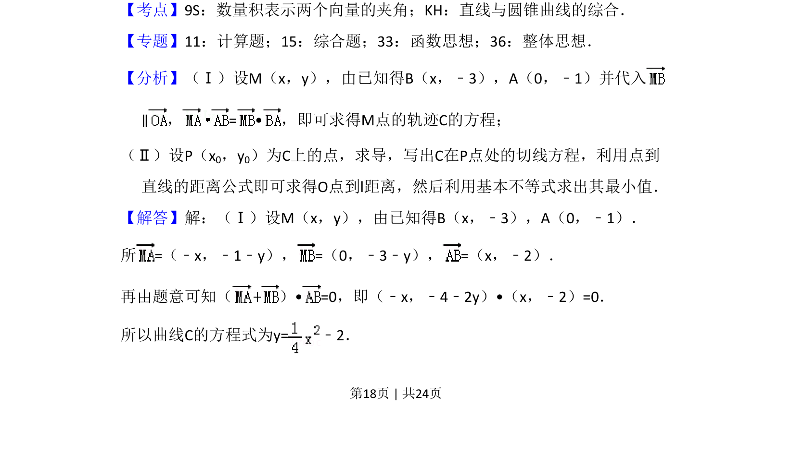
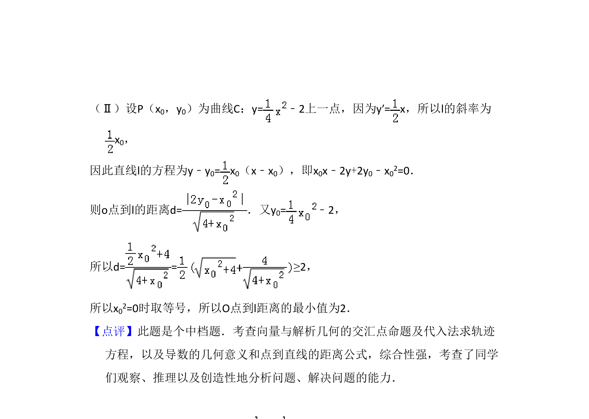

## 题面

## 摘要

本题考查利用向量条件求轨迹方程，以及抛物线的切线方程和点到直线距离的最值问题。

## 关联考点

- [[595-数量积表示两个向量的夹角|数量积表示两个向量的夹角]]
- [[1007-直线与圆锥曲线的综合|直线与圆锥曲线的综合]]
- [[376-圆锥曲线轨迹问题|轨迹方程]]
- [[422-切线方程|切线方程]]

## 答案与解析

> 📄 原 PDF 第 18 页：`素材/真题/吉林/2008-2024·（吉林）数学高考真题/2011年高考数学试卷（理）（新课标）（解析卷）.pdf`

<!-- 题干文本-start -->
## 题干文本
20．（12分）在平面直角坐标系xOy中，已知点A（0，﹣1），B点在直线y=﹣3
上，M点满足∥，= •，M点的轨迹为曲线C．
（Ⅰ）求C的方程；
（Ⅱ）P为C上的动点，l为C在P点处的切线，求O点到l距离的最小值．
<!-- 题干文本-end -->

<!-- 解析文本-start -->
## 解析文本
【考点】9S：数量积表示两个向量的夹角；KH：直线与圆锥曲线的综合．菁优网版权所有
【专题】11：计算题；15：综合题；33：函数思想；36：整体思想．
【分析】（Ⅰ）设M（x，y），由已知得B（x，﹣3），A（0，﹣1）并代入
∥，= •，即可求得M点的轨迹C的方程；
（Ⅱ）设P（x0，y0）为C上的点，求导，写出C在P点处的切线方程，利用点到
直线的距离公式即可求得O点到l距离，然后利用基本不等式求出其最小值．
【解答】解：（Ⅰ）设M（x，y），由已知得B（x，﹣3），A（0，﹣1）．
所=（﹣x，﹣1﹣y），=（0，﹣3﹣y），=（x，﹣2）．
再由题意可知（ ）• =0，即（﹣x，﹣4﹣2y）•（x，﹣2）=0．
所以曲线C的方程式为y=﹣2．
<!-- 解析文本-end -->
