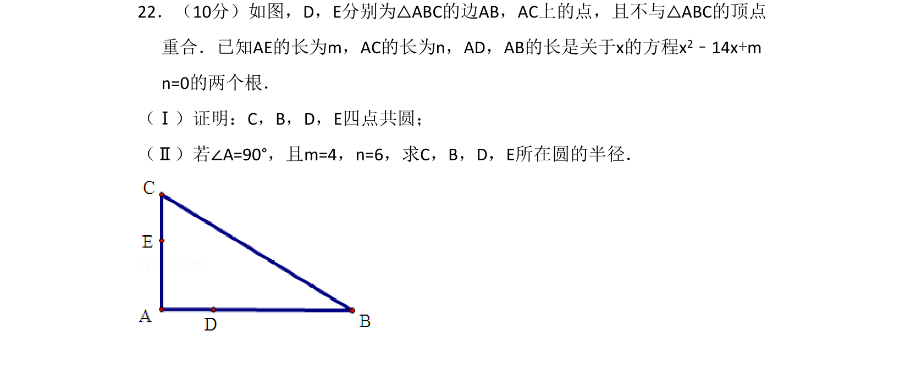
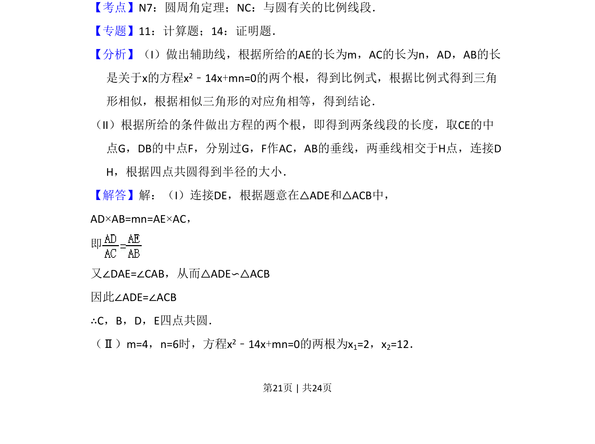
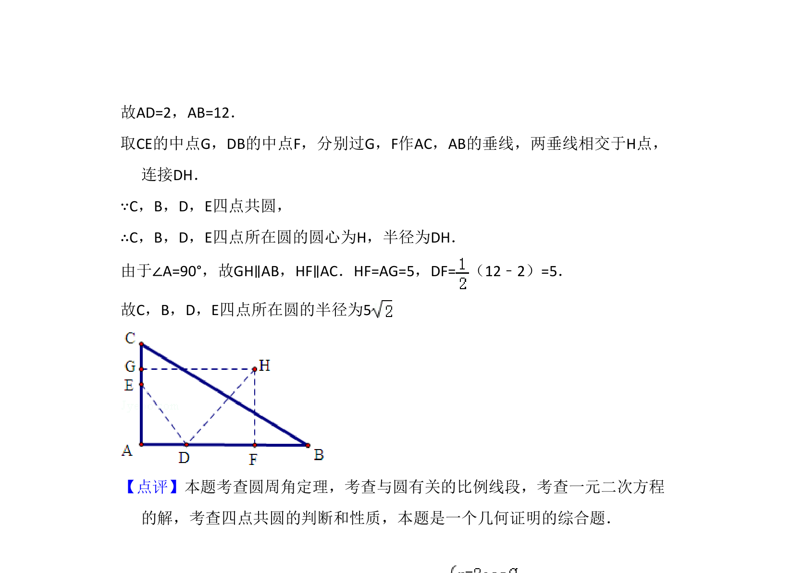

## 题面

## 摘要

四点共圆证明与相关半径计算，结合二次方程根与系数关系

## 关联考点

- [[221-圆周角定理|圆周角定理]]
- [[1177-与圆有关的比例线段|与圆有关的比例线段]]
- [[1034-相似三角形|相似三角形]]

## 答案与解析

> 📄 原 PDF 第 21 页：`素材/真题/吉林/2008-2024·（吉林）数学高考真题/2011年高考数学试卷（理）（新课标）（解析卷）.pdf`
