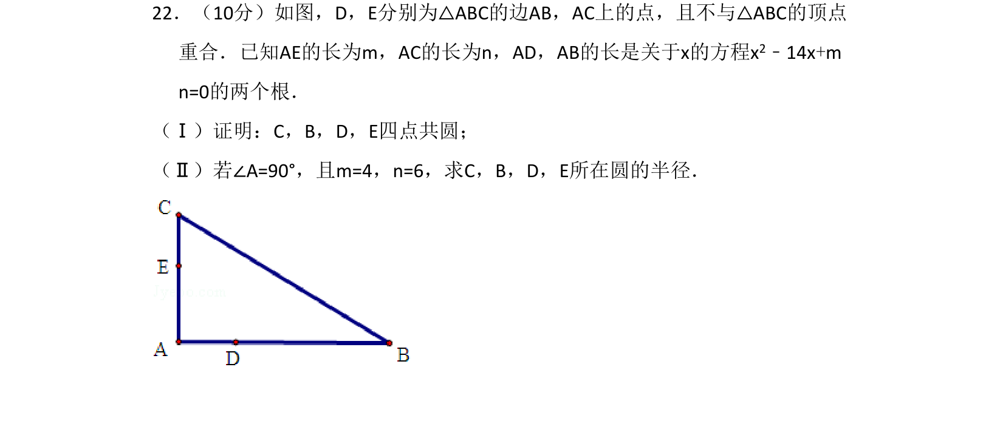
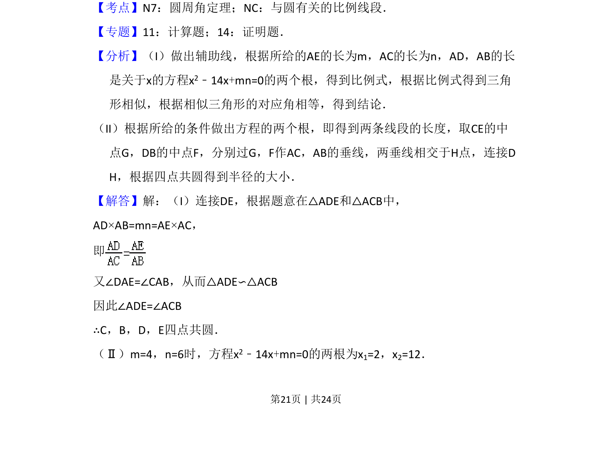
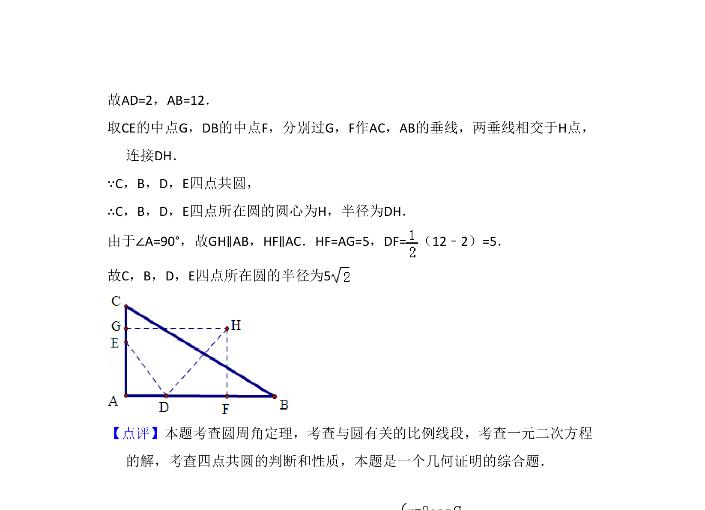

## 题面

## 摘要

四点共圆证明与相关半径计算，结合二次方程根与系数关系

## 关联考点

- [[221-圆周角定理|圆周角定理]]
- [[1176-与圆有关的比例线段|与圆有关的比例线段]]
- [[1033-相似三角形|相似三角形]]

## 答案与解析

> 📄 原 PDF 第 21 页：`素材/真题/吉林/2008-2024·（吉林）数学高考真题/2011年高考数学试卷（理）（新课标）（解析卷）.pdf`

<!-- 题干文本-start -->
## 题干文本
22．（10分）如图，D，E分别为△ABC的边AB，AC上的点，且不与△ABC的顶点
重合．已知AE的长为m，AC的长为n，AD，AB的长是关于x的方程x2﹣14x+m
n=0的两个根．
（Ⅰ）证明：C，B，D，E四点共圆；
（Ⅱ）若∠A=90°，且m=4，n=6，求C，B，D，E所在圆的半径．
<!-- 题干文本-end -->

<!-- 解析文本-start -->
## 解析文本
【考点】N7：圆周角定理；NC：与圆有关的比例线段．菁优网版权所有
【专题】11：计算题；14：证明题．
【分析】（I）做出辅助线，根据所给的AE的长为m，AC的长为n，AD，AB的长
是关于x的方程x2﹣14x+mn=0的两个根，得到比例式，根据比例式得到三角
形相似，根据相似三角形的对应角相等，得到结论．
（II）根据所给的条件做出方程的两个根，即得到两条线段的长度，取CE的中
点G，DB的中点F，分别过G，F作AC，AB的垂线，两垂线相交于H点，连接D
H，根据四点共圆得到半径的大小．
【解答】解：（I）连接DE，根据题意在△ADE和△ACB中，
AD×AB=mn=AE×AC，
即
又∠DAE=∠CAB，从而△ADE∽△ACB
因此∠ADE=∠ACB
∴C，B，D，E四点共圆．
（Ⅱ）m=4，n=6时，方程x2﹣14x+mn=0的两根为x1=2，x2=12．
<!-- 解析文本-end -->
