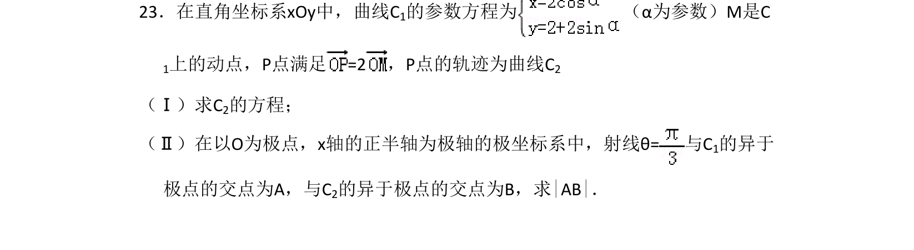
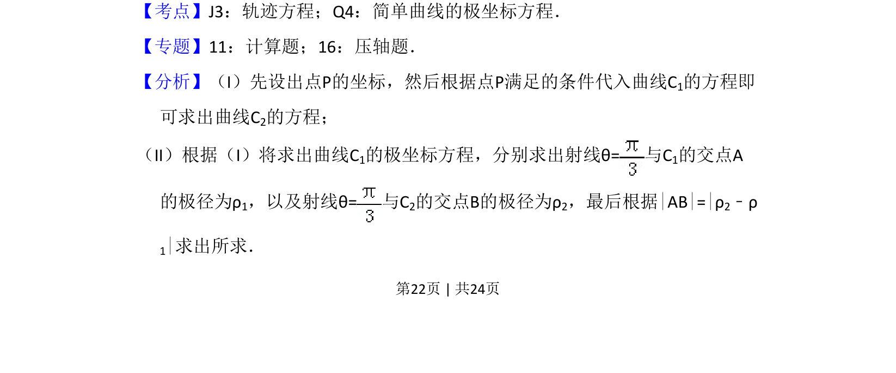
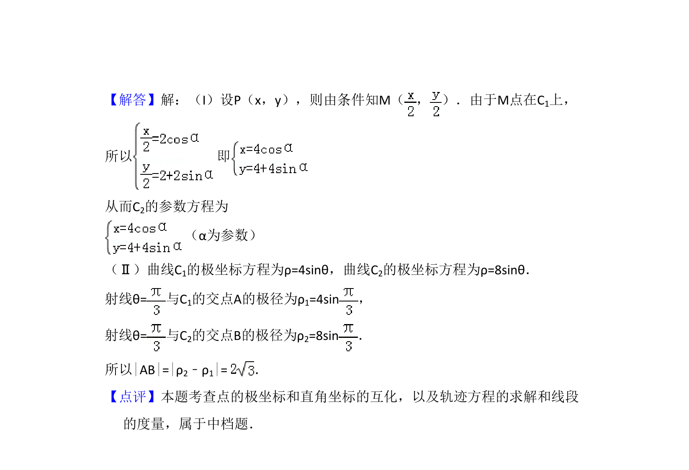

## 题面

## 摘要

本题考查根据参数方程求轨迹方程，以及在极坐标系下求两曲线交点的极径差。

## 关联考点

- [[376-圆锥曲线轨迹问题|轨迹方程]]
- [[1073-简单曲线的极坐标方程|简单曲线的极坐标方程]]
- [[061-方程|参数方程]]

## 答案与解析

> 📄 原 PDF 第 22 页：`素材/真题/吉林/2008-2024·（吉林）数学高考真题/2011年高考数学试卷（理）（新课标）（解析卷）.pdf`
