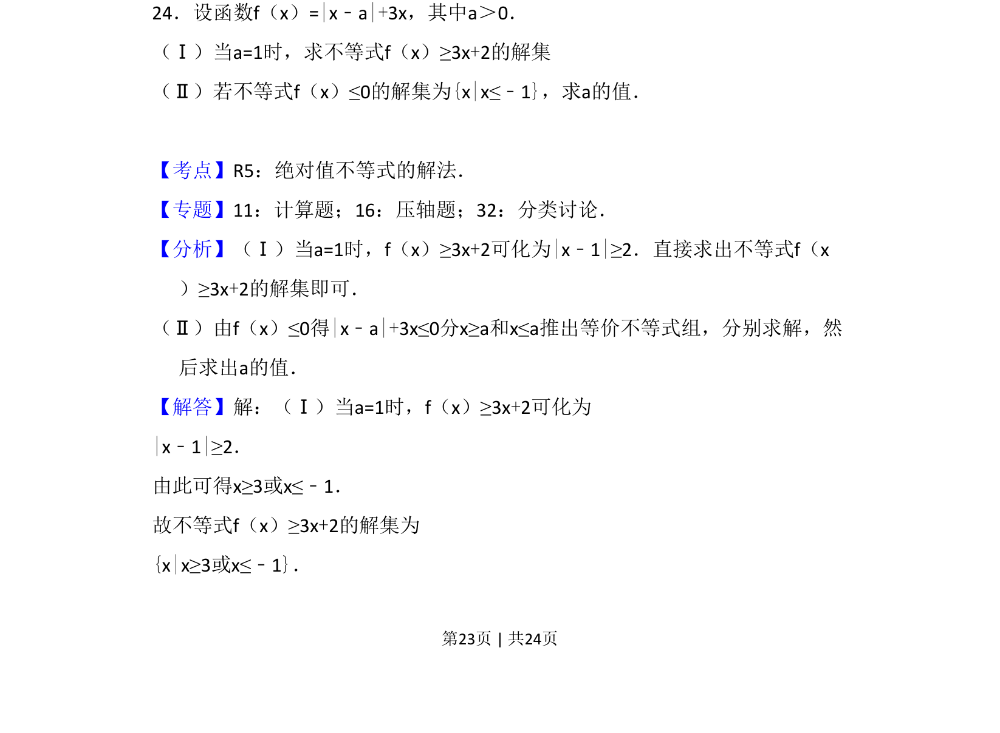
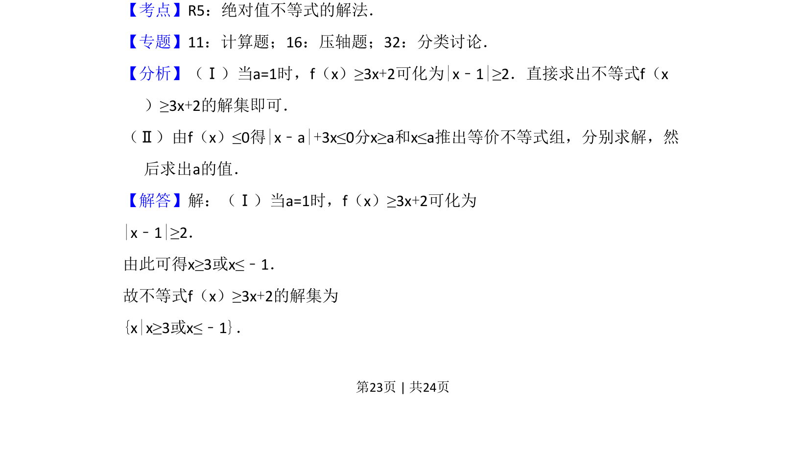
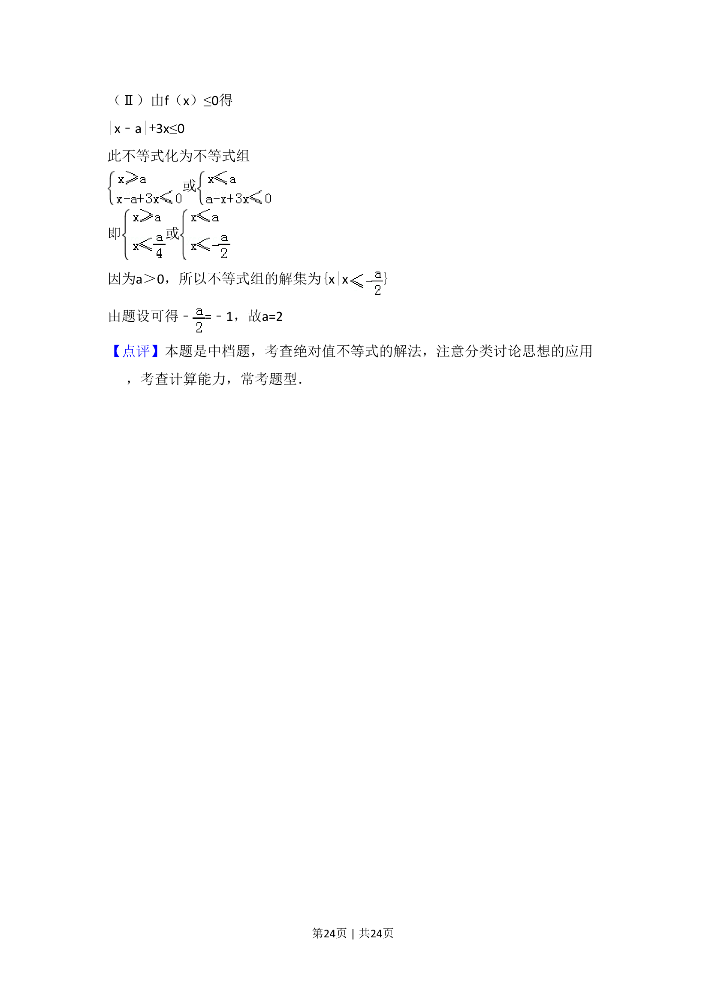

## 题面

## 摘要

求解含参数绝对值不等式及根据解集求参数，涉及分类讨论思想。

## 关联考点

- [[1092-绝对值不等式|绝对值不等式]]
- [[758-含参数不等式|含参数不等式]]
- [[424-参数分类讨论|分类讨论]]

## 答案与解析

> 📄 原 PDF 第 23 页：`素材/真题/吉林/2008-2024·（吉林）数学高考真题/2011年高考数学试卷（理）（新课标）（解析卷）.pdf`

<!-- 题干文本-start -->
## 题干文本
24．设函数f（x）=|x﹣a|+3x，其中a＞0．
（Ⅰ）当a=1时，求不等式f（x）≥3x+2的解集
（Ⅱ）若不等式f（x）≤0的解集为{x|x≤﹣1}，求a的值．
<!-- 题干文本-end -->

<!-- 解析文本-start -->
## 解析文本
【考点】R5：绝对值不等式的解法．菁优网版权所有
【专题】11：计算题；16：压轴题；32：分类讨论．
【分析】（Ⅰ）当a=1时，f（x）≥3x+2可化为|x﹣1|≥2．直接求出不等式f（x
）≥3x+2的解集即可．
（Ⅱ）由f（x）≤0得|x﹣a|+3x≤0分x≥a和x≤a推出等价不等式组，分别求解，然
后求出a的值．
【解答】解：（Ⅰ）当a=1时，f（x）≥3x+2可化为
|x﹣1|≥2．
由此可得x≥3或x≤﹣1．
故不等式f（x）≥3x+2的解集为
{x|x≥3或x≤﹣1}．
<!-- 解析文本-end -->
