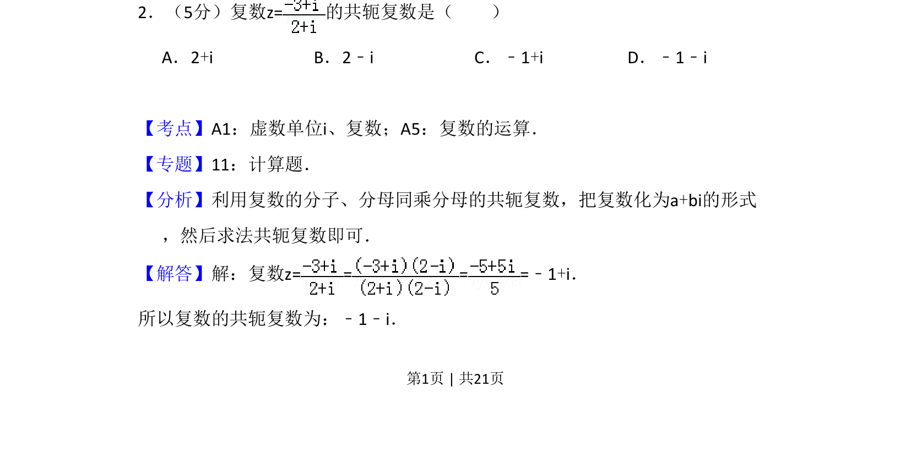
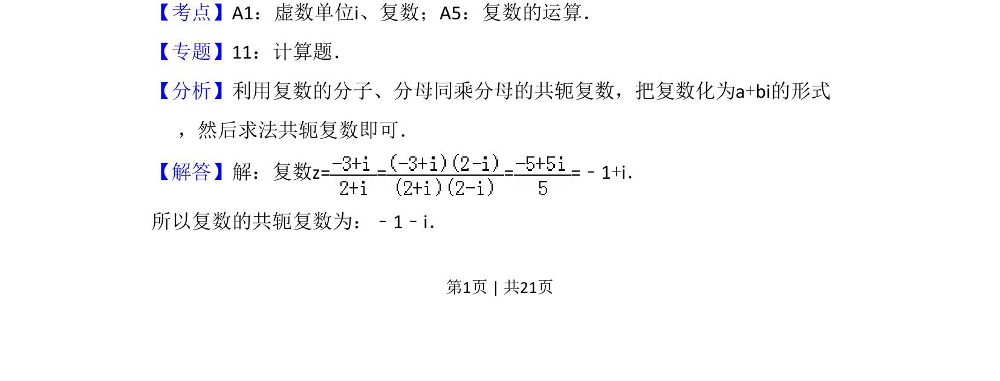
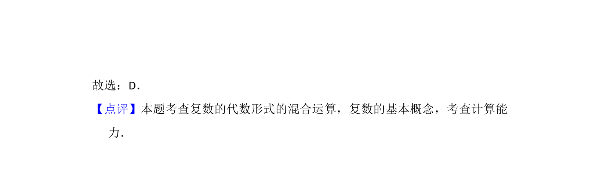

## 题面

## 摘要

本题考查复数的除法运算及其共轭复数的求法。

## 关联考点

- [[811-复数运算|复数运算]]
- [[534-共轭复数|共轭复数]]
- [[588-虚数单位|虚数单位]]

## 答案与解析

> 📄 原 PDF 第 1 页：`素材/真题/吉林/2008-2024·（吉林）数学高考真题/2012年高考数学试卷（文）（新课标）（解析卷）.pdf`

<!-- 题干文本-start -->
## 题干文本
2．（5分）复数z=的共轭复数是（　　）
A．2+i B．2﹣i C．﹣1+i D．﹣1﹣i
<!-- 题干文本-end -->

<!-- 解析文本-start -->
## 解析文本
【考点】A1：虚数单位i、复数；A5：复数的运算．菁优网版权所有
【专题】11：计算题．
【分析】利用复数的分子、分母同乘分母的共轭复数，把复数化为a+bi的形式
，然后求法共轭复数即可．
【解答】解：复数z= = = =﹣1+i．
所以复数的共轭复数为：﹣1﹣i．
<!-- 解析文本-end -->
