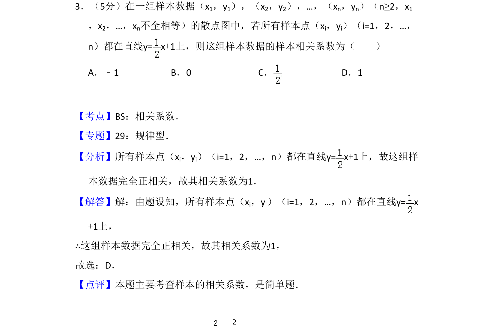
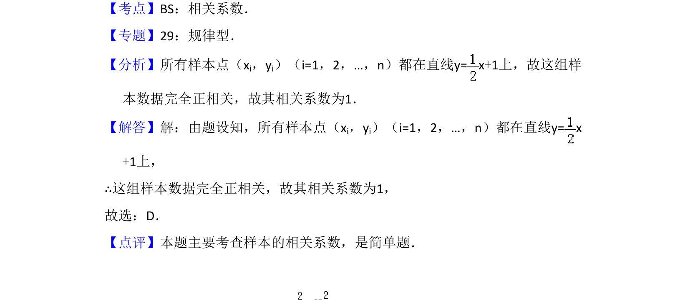

## 题面

## 摘要

所有样本点落在直线上时，样本相关系数为完全正相关，考查相关系数的概念。

## 关联考点

- [[359-统计案例|相关系数]]
- [[502-线性相关性|正相关]]

## 答案与解析

> 📄 原 PDF 第 2 页：`素材/真题/吉林/2008-2024·（吉林）数学高考真题/2012年高考数学试卷（文）（新课标）（解析卷）.pdf`

<!-- 题干文本-start -->
## 题干文本
3．（5分）在一组样本数据（x1，y1），（x2，y2），…，（xn，yn）（n≥2，x1
，x2，…，xn不全相等）的散点图中，若所有样本点（xi，yi）（i=1，2，…，
n）都在直线y= x+1上，则这组样本数据的样本相关系数为（　　）
A．﹣1 B．0 C．D．1
<!-- 题干文本-end -->

<!-- 解析文本-start -->
## 解析文本
【考点】BS：相关系数．菁优网版权所有
【专题】29：规律型．
【分析】所有样本点（xi，yi）（i=1，2，…，n）都在直线y= x+1上，故这组样
本数据完全正相关，故其相关系数为1．
【解答】解：由题设知，所有样本点（xi，yi）（i=1，2，…，n）都在直线y= x
+1上，
∴这组样本数据完全正相关，故其相关系数为1，
故选：D．
【点评】本题主要考查样本的相关系数，是简单题．
<!-- 解析文本-end -->
