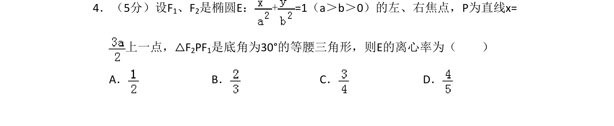
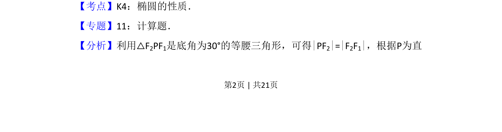
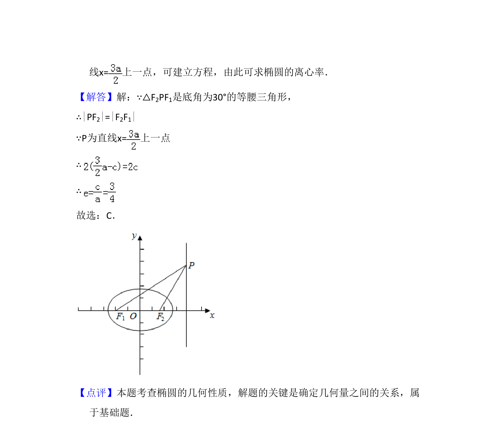

## 题面

## 摘要

该题考查椭圆离心率的求解，利用等腰三角形和焦点三角形几何关系建立方程。

## 关联考点

- [[388-椭圆几何性质|椭圆性质]]
- [[391-椭圆离心率|离心率]]
- [[焦点三角形]]
- [[171-等腰三角形性质|等腰三角形]]

## 答案与解析

> 📄 原 PDF 第 2 页：`素材/真题/吉林/2008-2024·（吉林）数学高考真题/2012年高考数学试卷（文）（新课标）（解析卷）.pdf`
