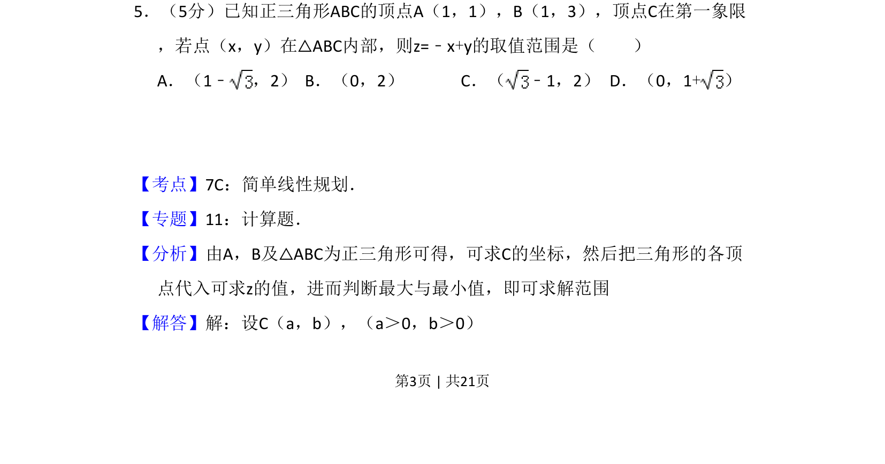
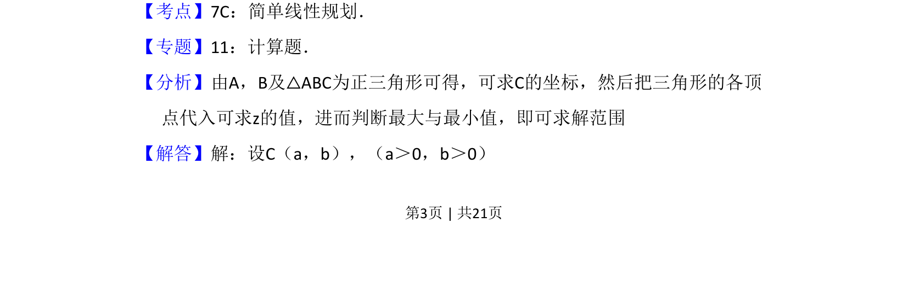
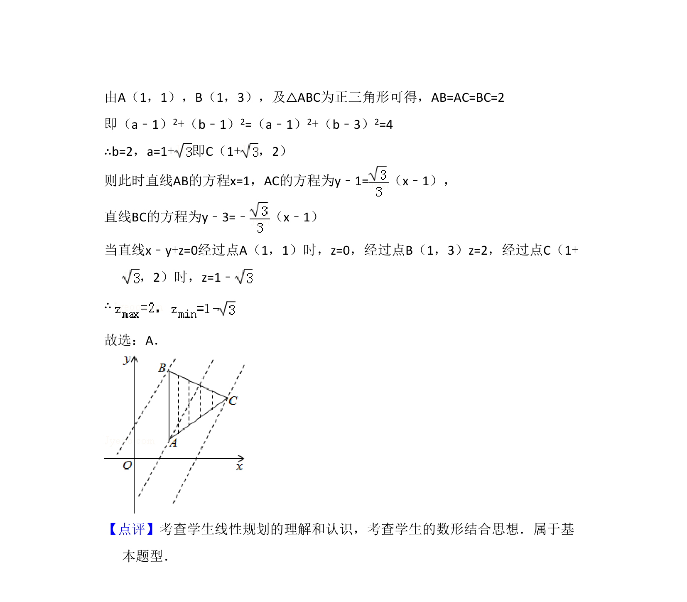

## 题面

## 摘要

已知三角形顶点坐标，求内部点满足的线性目标函数取值范围，涉及简单线性规划

## 关联考点

- [[1074-简单线性规划|简单线性规划]]
- [[852-平面区域|平面区域]]
- [[1000-目标函数最值|目标函数最值]]

## 答案与解析

> 📄 原 PDF 第 3 页：`素材/真题/吉林/2008-2024·（吉林）数学高考真题/2012年高考数学试卷（文）（新课标）（解析卷）.pdf`
