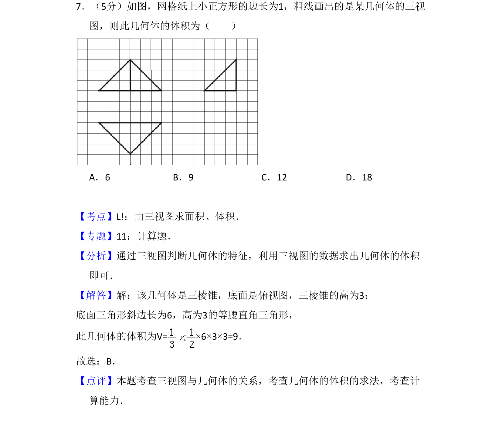
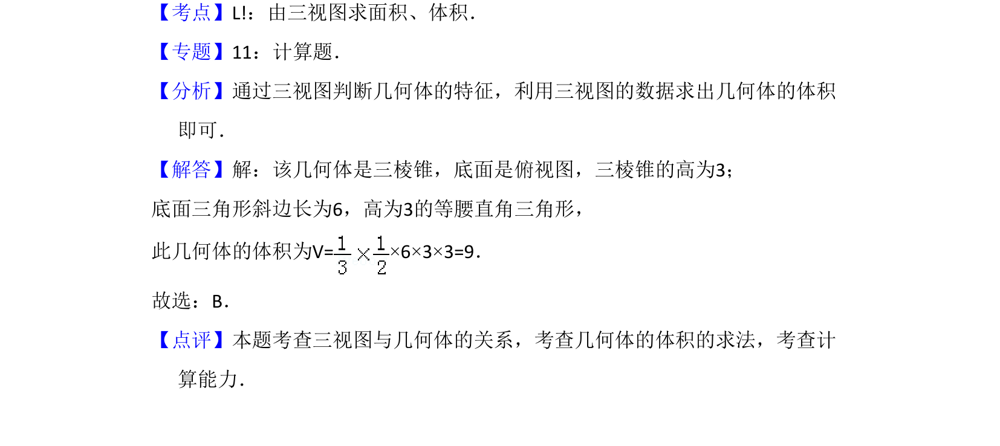

## 题面

## 摘要

由三视图还原三棱锥，利用锥体体积公式求解体积

## 关联考点

- [[997-由三视图求体积|由三视图求体积]]
- [[599-三棱锥|三棱锥]]
- [[651-体积公式|体积公式]]

## 答案与解析

> 📄 原 PDF 第 6 页：`素材/真题/吉林/2008-2024·（吉林）数学高考真题/2012年高考数学试卷（文）（新课标）（解析卷）.pdf`
