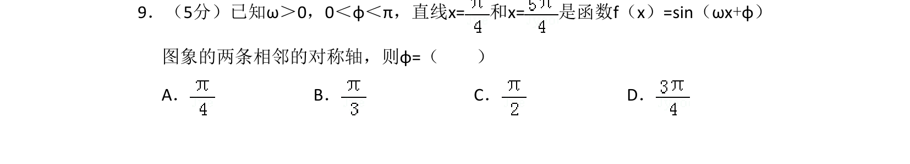
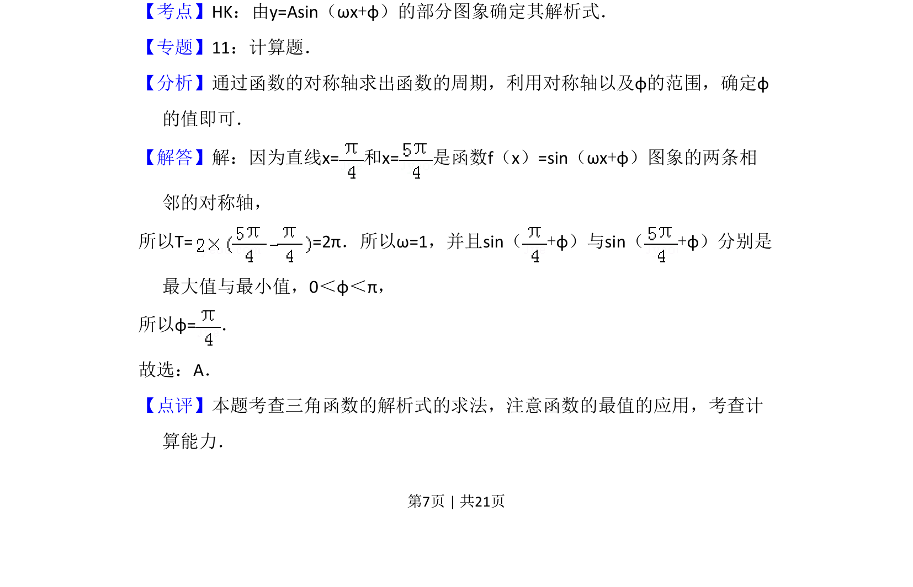

## 题面

## 摘要

已知正弦函数的两条相邻对称轴，利用对称轴间距求周期，进而确定参数φ的值。

## 关联考点

- [[530-三角函数的对称轴|三角函数的对称轴]]
- [[261-周期|周期]]
- [[997-由函数图象求解析式|由函数图象求解析式]]

## 答案与解析

> 📄 原 PDF 第 7 页：`素材/真题/吉林/2008-2024·（吉林）数学高考真题/2012年高考数学试卷（文）（新课标）（解析卷）.pdf`
