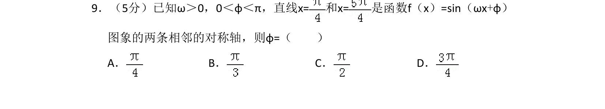
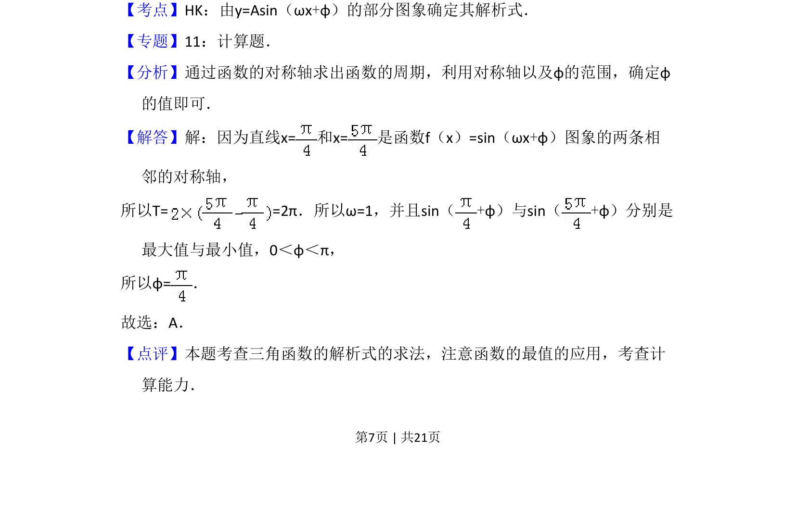

## 题面

## 摘要

已知正弦函数的两条相邻对称轴，利用对称轴间距求周期，进而确定参数φ的值。

## 关联考点

- [[530-三角函数的对称轴|三角函数的对称轴]]
- [[261-周期|周期]]
- [[997-由函数图象求解析式|由函数图象求解析式]]

## 答案与解析

> 📄 原 PDF 第 7 页：`素材/真题/吉林/2008-2024·（吉林）数学高考真题/2012年高考数学试卷（文）（新课标）（解析卷）.pdf`

<!-- 题干文本-start -->
## 题干文本
9．（5分）已知ω＞0，0＜φ＜π，直线x=和x=是函数f（x）=sin（ωx+φ）
图象的两条相邻的对称轴，则φ=（　　）
A．B．C．D．
<!-- 题干文本-end -->

<!-- 解析文本-start -->
## 解析文本
【考点】HK：由y=Asin（ωx+φ）的部分图象确定其解析式．菁优网版权所有
【专题】11：计算题．
【分析】通过函数的对称轴求出函数的周期，利用对称轴以及φ的范围，确定φ
的值即可．
【解答】解：因为直线x=和x=是函数f（x）=sin（ωx+φ）图象的两条相
邻的对称轴，
所以T==2π．所以ω=1，并且sin（+φ）与sin（+φ）分别是
最大值与最小值，0＜φ＜π，
所以φ=．
故选：A．
【点评】本题考查三角函数的解析式的求法，注意函数的最值的应用，考查计
算能力．
<!-- 解析文本-end -->
