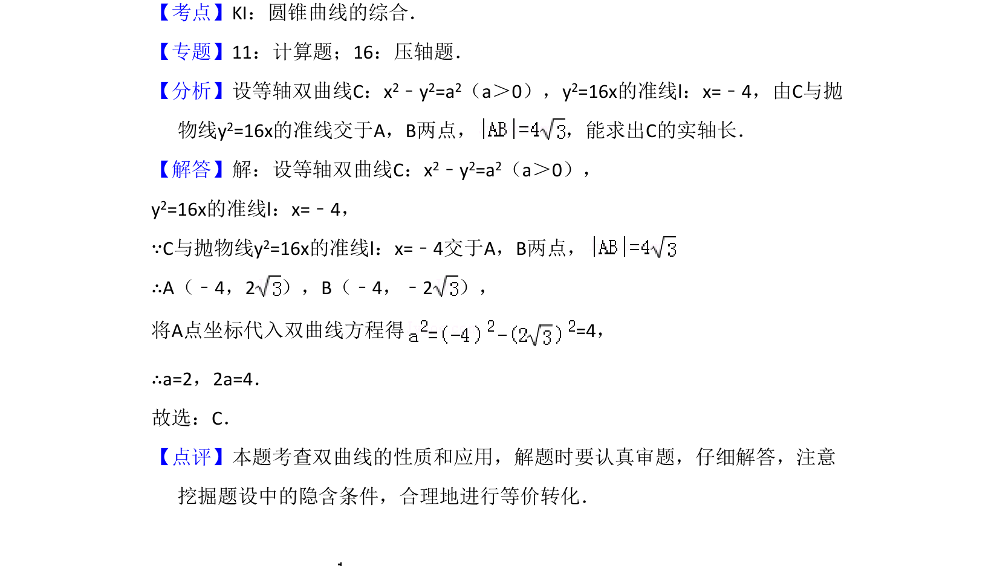

## 题面

## 摘要

通过等轴双曲线与抛物线准线相交的弦长求双曲线实轴长。

## 关联考点

- [[1071-等轴双曲线|等轴双曲线]]
- [[551-抛物线的准线|抛物线准线]]
- [[866-弦长|弦长]]
- [[1210-实轴长|实轴长]]

## 答案与解析

> 📄 原 PDF 第 8 页：`素材/真题/吉林/2008-2024·（吉林）数学高考真题/2012年高考数学试卷（文）（新课标）（解析卷）.pdf`

<!-- 题干文本-start -->
## 题干文本
10．（5分）等轴双曲线C的中心在原点，焦点在x轴上，C与抛物线y2=16x的准
线交于点A和点B，|AB|=4，则C的实轴长为（　　）
A．B．C．4 D．8
<!-- 题干文本-end -->

<!-- 解析文本-start -->
## 解析文本
【考点】KI：圆锥曲线的综合．菁优网版权所有
【专题】11：计算题；16：压轴题．
【分析】设等轴双曲线C：x2﹣y2=a2（a＞0），y2=16x的准线l：x=﹣4，由C与抛
物线y2=16x的准线交于A，B两点， ，能求出C的实轴长．
【解答】解：设等轴双曲线C：x2﹣y2=a2（a＞0），
y2=16x的准线l：x=﹣4，
∵C与抛物线y2=16x的准线l：x=﹣4交于A，B两点，
∴A（﹣4，2），B（﹣4，﹣2），
将A点坐标代入双曲线方程得=4，
∴a=2，2a=4．
故选：C．
【点评】本题考查双曲线的性质和应用，解题时要认真审题，仔细解答，注意
挖掘题设中的隐含条件，合理地进行等价转化．
<!-- 解析文本-end -->
