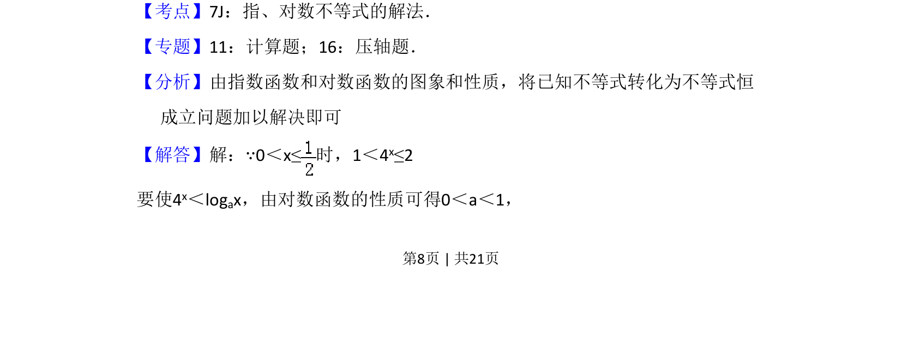
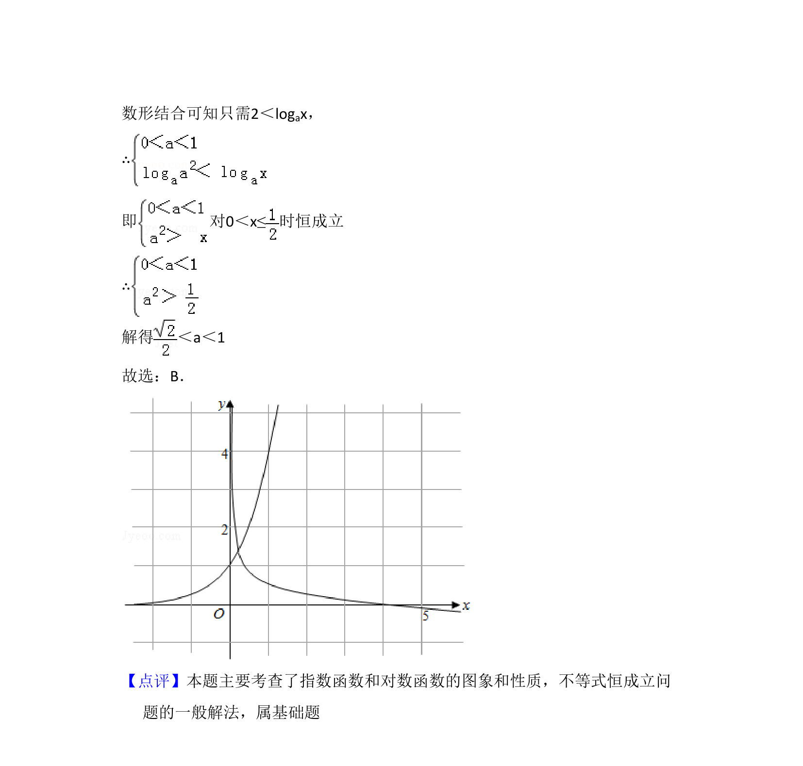

## 题面

## 摘要

本题考查给定区间上指数与对数不等式恒成立求参数范围的问题。

## 关联考点

- [[304-指数函数|指数函数]]
- [[298-对数函数|对数函数]]
- [[531-不等式恒成立|不等式恒成立]]
- [[726-参数范围|参数范围]]

## 答案与解析

> 📄 原 PDF 第 8 页：`素材/真题/吉林/2008-2024·（吉林）数学高考真题/2012年高考数学试卷（文）（新课标）（解析卷）.pdf`

<!-- 题干文本-start -->
## 题干文本
11．（5分）当0＜x≤时，4 x＜logax，则a的取值范围是（　　）
A．（0， ）B．（ ，1）C．（1， ）D．（ ，2）
<!-- 题干文本-end -->

<!-- 解析文本-start -->
## 解析文本
【考点】7J：指、对数不等式的解法．菁优网版权所有
【专题】11：计算题；16：压轴题．
【分析】由指数函数和对数函数的图象和性质，将已知不等式转化为不等式恒
成立问题加以解决即可
【解答】解：∵0＜x≤时，1＜4 x≤2
要使4x＜logax，由对数函数的性质可得0＜a＜1，
<!-- 解析文本-end -->
