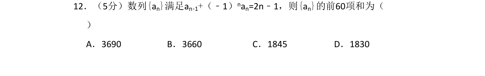
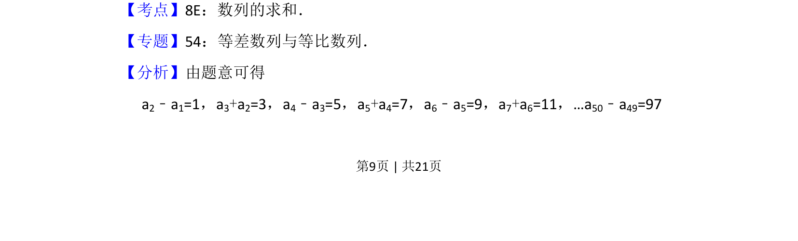

## 题面

## 摘要

求解由递推关系给出的数列前60项和，利用奇偶项分组转化为等差数列求和。

## 关联考点

- [[数列求和]]
- [[356-等差数列概念|等差数列]]
- [[383-数列递推公式|递推关系]]
- [[421-分组求和|分组求和]]

## 答案与解析

> 📄 原 PDF 第 9 页：`素材/真题/吉林/2008-2024·（吉林）数学高考真题/2012年高考数学试卷（文）（新课标）（解析卷）.pdf`
