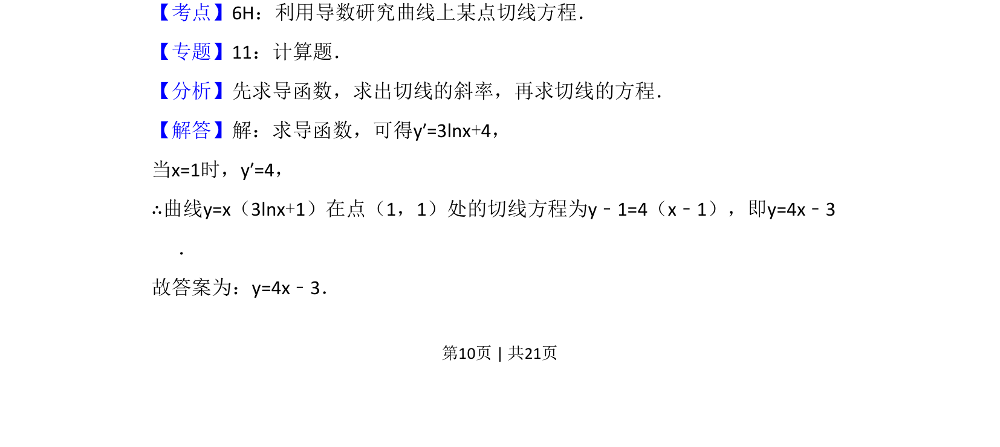
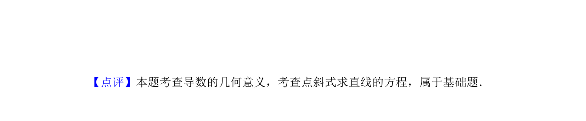

## 题面

## 摘要

求曲线在某点的切线方程，需先求导得斜率，再用点斜式写出方程。

## 关联考点

- [[440-导数的几何意义|导数的几何意义]]
- [[422-切线方程|切线方程]]
- [[973-求导运算|求导运算]]

## 答案与解析

> 📄 原 PDF 第 10 页：`素材/真题/吉林/2008-2024·（吉林）数学高考真题/2012年高考数学试卷（文）（新课标）（解析卷）.pdf`

<!-- 题干文本-start -->
## 题干文本
13．（5分）曲线y=x（3lnx+1）在点（1，1）处的切线方程为　y=4x﹣3　．
<!-- 题干文本-end -->

<!-- 解析文本-start -->
## 解析文本
【考点】6H：利用导数研究曲线上某点切线方程．菁优网版权所有
【专题】11：计算题．
【分析】先求导函数，求出切线的斜率，再求切线的方程．
【解答】解：求导函数，可得y′=3lnx+4，
当x=1时，y′=4，
∴曲线y=x（3lnx+1）在点（1，1）处的切线方程为y﹣1=4（x﹣1），即y=4x﹣3
．
故答案为：y=4x﹣3．
<!-- 解析文本-end -->
