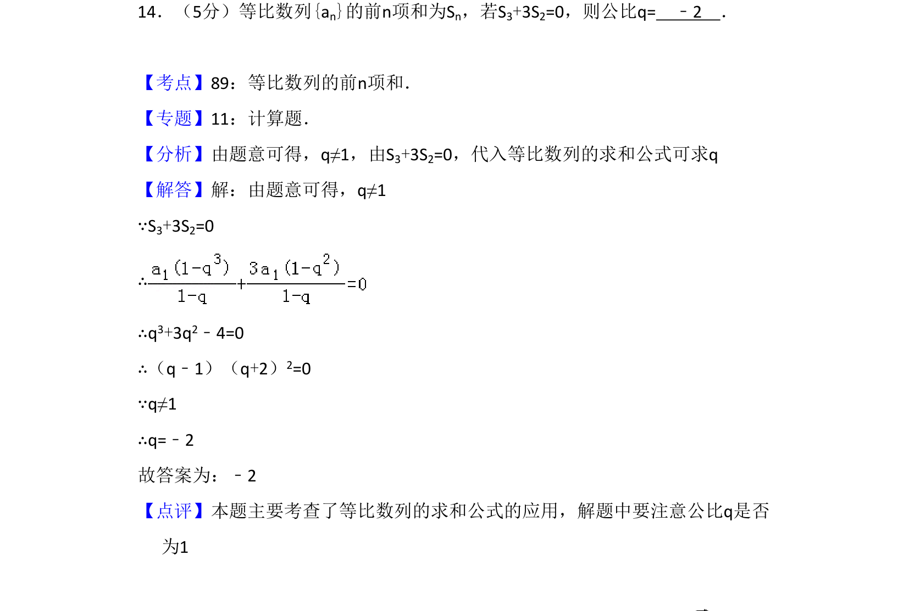
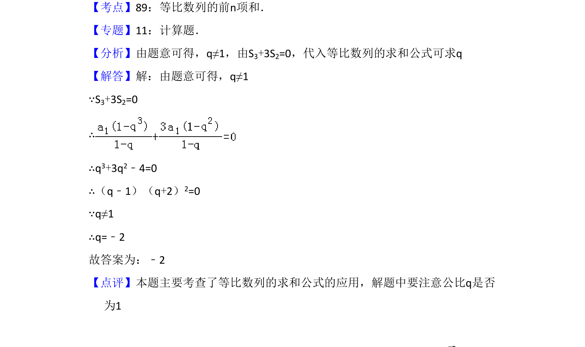

## 题面

## 摘要

该题考查等比数列前n项和公式应用，由条件方程求公比，注意排除q=1

## 关联考点

- [[358-等比数列概念|等比数列]]
- [[713-前n项和公式|前n项和公式]]
- [[424-参数分类讨论|分类讨论]]

## 答案与解析

> 📄 原 PDF 第 11 页：`素材/真题/吉林/2008-2024·（吉林）数学高考真题/2012年高考数学试卷（文）（新课标）（解析卷）.pdf`
