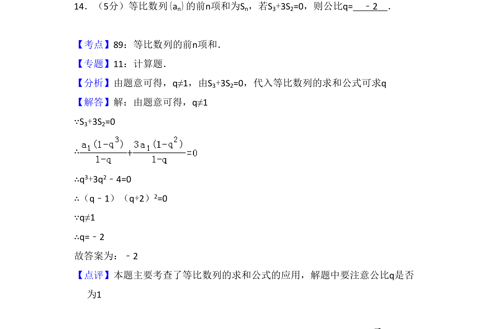
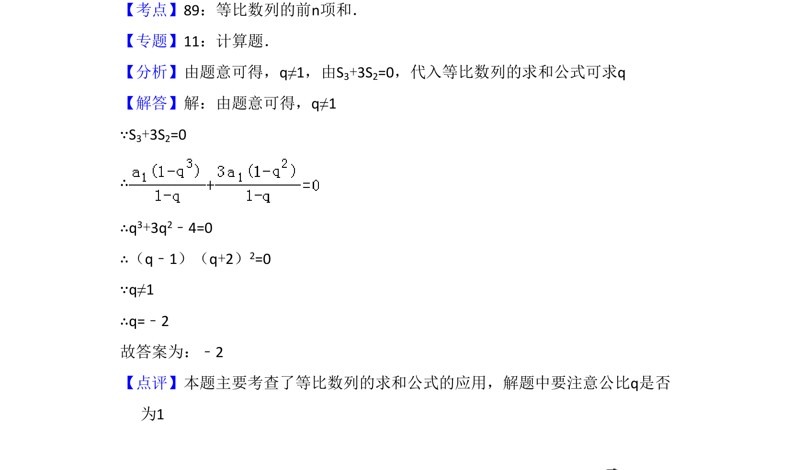

## 题面

## 摘要

该题考查等比数列前n项和公式应用，由条件方程求公比，注意排除q=1

## 关联考点

- [[358-等比数列概念|等比数列]]
- [[713-前n项和公式|前n项和公式]]
- [[424-参数分类讨论|分类讨论]]

## 答案与解析

> 📄 原 PDF 第 11 页：`素材/真题/吉林/2008-2024·（吉林）数学高考真题/2012年高考数学试卷（文）（新课标）（解析卷）.pdf`

<!-- 题干文本-start -->
## 题干文本
14．（5分）等比数列{an}的前n项和为Sn，若S3+3S2=0，则公比q=　﹣2　．
<!-- 题干文本-end -->

<!-- 解析文本-start -->
## 解析文本
【考点】89：等比数列的前n项和．菁优网版权所有
【专题】11：计算题．
【分析】由题意可得，q≠1，由S3+3S2=0，代入等比数列的求和公式可求q
【解答】解：由题意可得，q≠1
∵S3+3S2=0
∴
∴q3+3q2﹣4=0
∴（q﹣1）（q+2）2=0
∵q≠1
∴q=﹣2
故答案为：﹣2
【点评】本题主要考查了等比数列的求和公式的应用，解题中要注意公比q是否
为1
<!-- 解析文本-end -->
