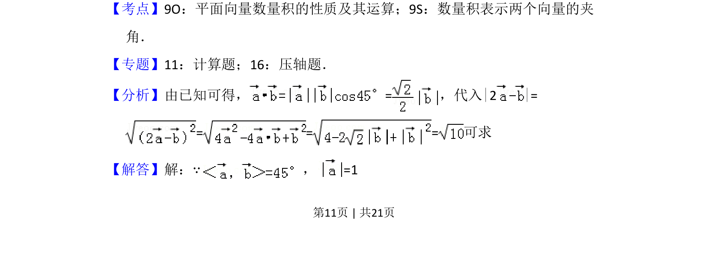
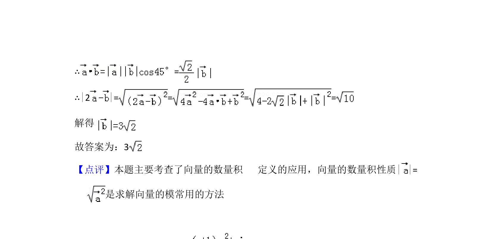

## 题面

## 摘要

已知向量夹角与模长，求含模长与数量积的表达式值。

## 关联考点

- [[854-平面向量数量积|平面向量数量积]]
- [[901-数量积表示向量夹角|数量积表示向量夹角]]
- [[752-向量模长|向量模长]]

## 答案与解析

> 📄 原 PDF 第 11 页：`素材/真题/吉林/2008-2024·（吉林）数学高考真题/2012年高考数学试卷（文）（新课标）（解析卷）.pdf`
