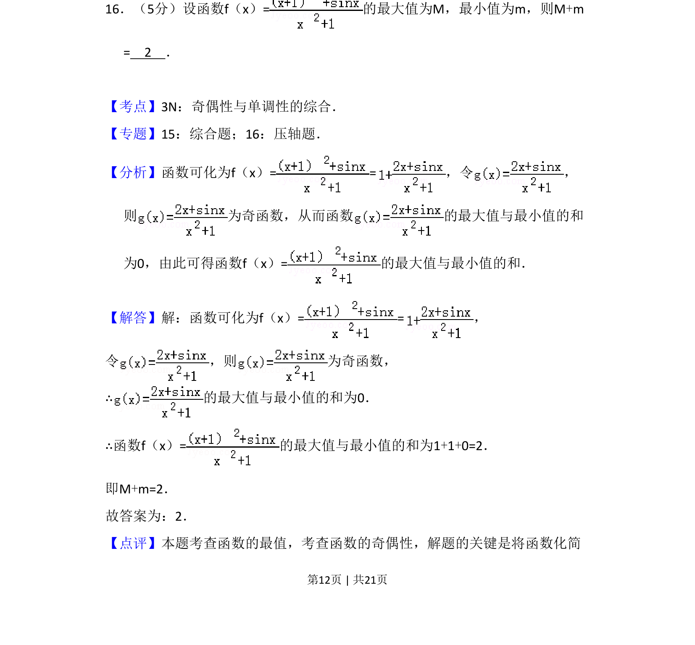
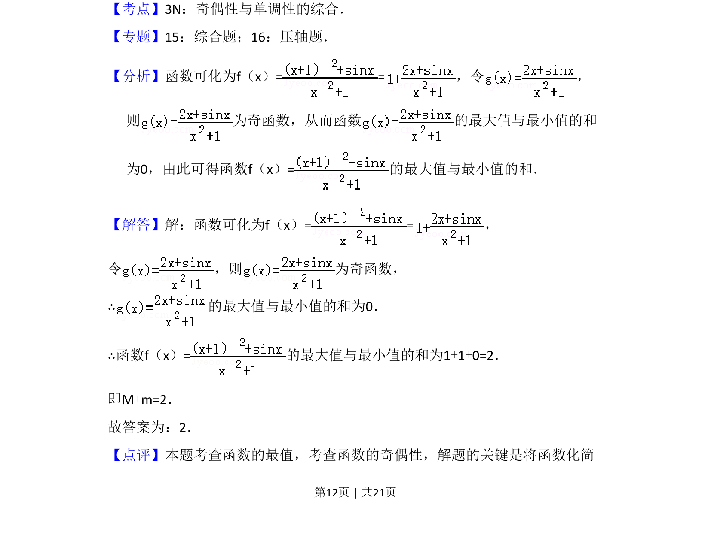
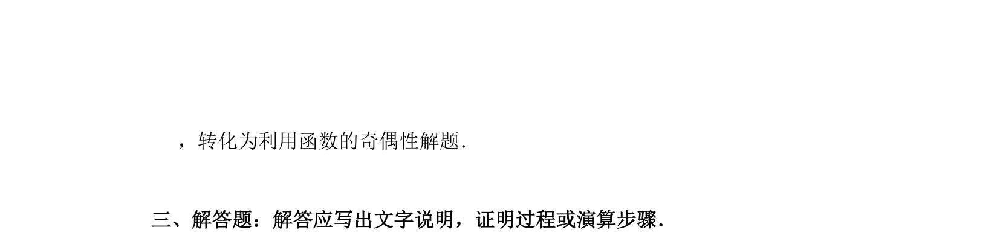

## 题面

## 摘要

利用奇函数性质求函数最大值与最小值之和

## 关联考点

- [[817-奇偶性|奇偶性]]
- [[419-函数最值-高中|函数最值]]
- [[284-函数的奇偶性|奇函数]]

## 答案与解析

> 📄 原 PDF 第 12 页：`素材/真题/吉林/2008-2024·（吉林）数学高考真题/2012年高考数学试卷（文）（新课标）（解析卷）.pdf`

<!-- 题干文本-start -->
## 题干文本
16．（5分）设函数f（x）=的最大值为M，最小值为m，则M+m
=　2　．
<!-- 题干文本-end -->

<!-- 解析文本-start -->
## 解析文本
【考点】3N：奇偶性与单调性的综合．菁优网版权所有
【专题】15：综合题；16：压轴题．
【分析】函数可化为f（x）= =，令 ，
则 为奇函数，从而函数 的最大值与最小值的和
为0，由此可得函数f（x）=的最大值与最小值的和．
【解答】解：函数可化为f（x）= =，
令 ，则 为奇函数，
∴的最大值与最小值的和为0．
∴函数f（x）=的最大值与最小值的和为1+1+0=2．
即M+m=2．
故答案为：2．
【点评】本题考查函数的最值，考查函数的奇偶性，解题的关键是将函数化简
<!-- 解析文本-end -->
