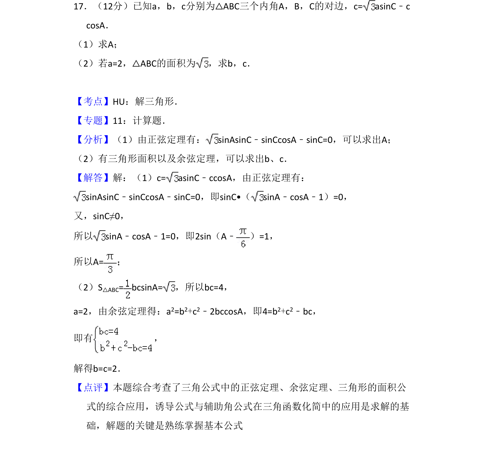
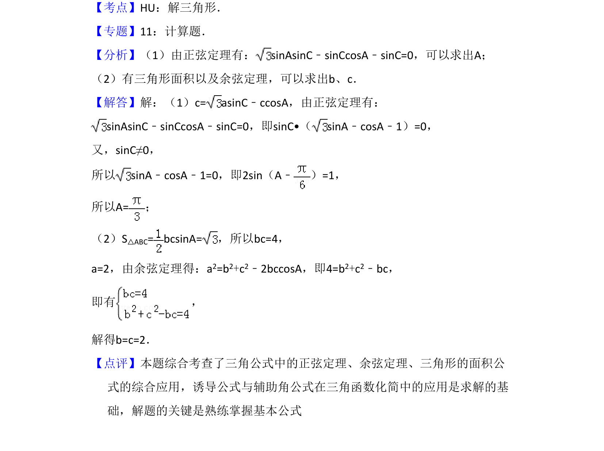

## 题面

## 摘要

本题通过已知边角关系求角A，再利用三角形面积和余弦定理求边长b、c。

## 关联考点

- [[126-定理|正弦定理]]
- [[126-定理|余弦定理]]
- [[三角形面积公式]]
- [[辅助角公式]]

## 答案与解析

> 📄 原 PDF 第 13 页：`素材/真题/吉林/2008-2024·（吉林）数学高考真题/2012年高考数学试卷（文）（新课标）（解析卷）.pdf`
