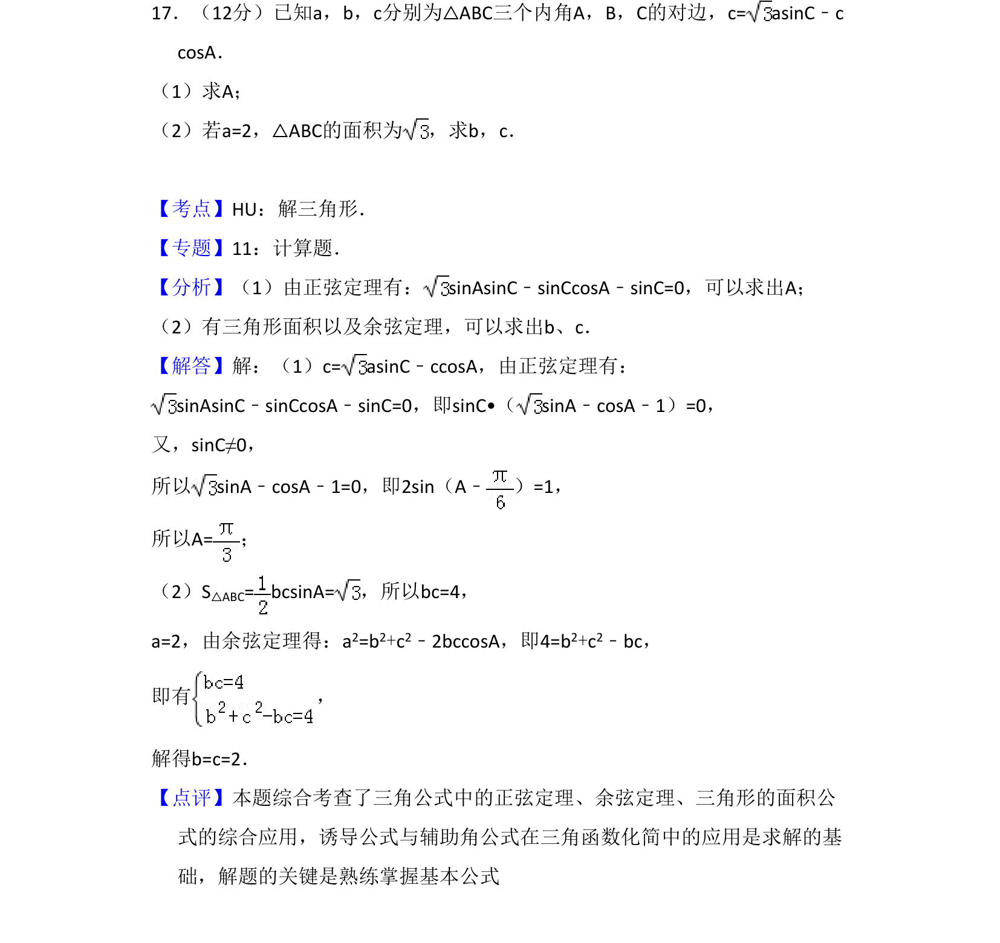
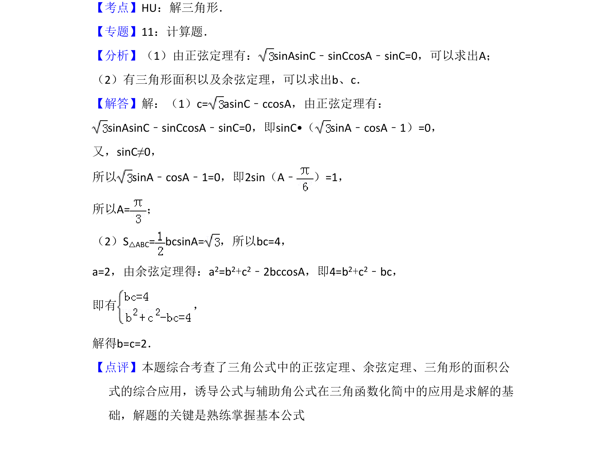

## 题面

## 摘要

本题通过已知边角关系求角A，再利用三角形面积和余弦定理求边长b、c。

## 关联考点

- [[126-定理|正弦定理]]
- [[126-定理|余弦定理]]
- [[619-三角形面积公式|三角形面积公式]]
- [[1126-辅助角公式|辅助角公式]]

## 答案与解析

> 📄 原 PDF 第 13 页：`素材/真题/吉林/2008-2024·（吉林）数学高考真题/2012年高考数学试卷（文）（新课标）（解析卷）.pdf`

<!-- 题干文本-start -->
## 题干文本
17．（12分）已知a，b，c分别为△ABC三个内角A，B，C的对边，c= asinC﹣c
cosA．
（1）求A；
（2）若a=2，△ABC的面积为 ，求b，c．
<!-- 题干文本-end -->

<!-- 解析文本-start -->
## 解析文本
【考点】HU：解三角形．菁优网版权所有
【专题】11：计算题．
【分析】（1）由正弦定理有：sinAsinC﹣sinCcosA﹣sinC=0，可以求出A；
（2）有三角形面积以及余弦定理，可以求出b、c．
【解答】解：（1）c= asinC﹣ccosA，由正弦定理有：
sinAsinC﹣sinCcosA﹣sinC=0，即sinC•（sinA﹣cosA﹣1）=0，
又，sinC≠0，
所以sinA﹣cosA﹣1=0，即2sin（A﹣ ）=1，
所以A=；
（2）S△ABC= bcsinA=，所以bc=4，
a=2，由余弦定理得：a2=b2+c2﹣2bccosA，即4=b2+c2﹣bc，
即有 ，
解得b=c=2．
【点评】本题综合考查了三角公式中的正弦定理、余弦定理、三角形的面积公
式的综合应用，诱导公式与辅助角公式在三角函数化简中的应用是求解的基
础，解题的关键是熟练掌握基本公式
<!-- 解析文本-end -->
