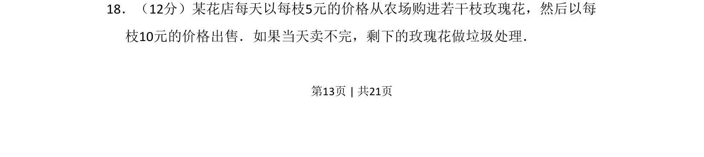
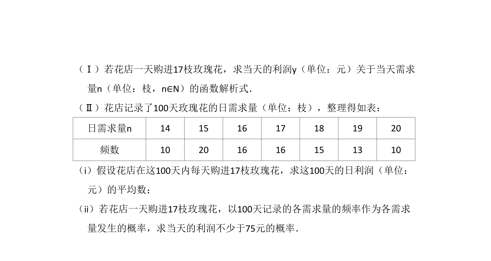
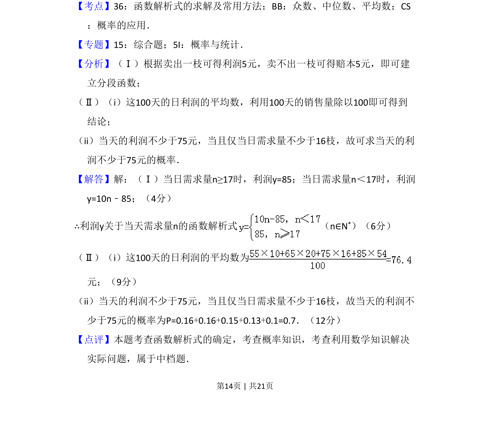

## 题面

## 摘要

考查利用概率分布求期望并建立利润函数模型，解决实际销售决策问题。

## 关联考点

- [[914-期望|期望]]
- [[419-函数最值-高中|函数最值]]
- [[566-概率分布|概率分布]]

## 答案与解析

> 📄 原 PDF 第 13 页：`素材/真题/吉林/2008-2024·（吉林）数学高考真题/2012年高考数学试卷（文）（新课标）（解析卷）.pdf`
