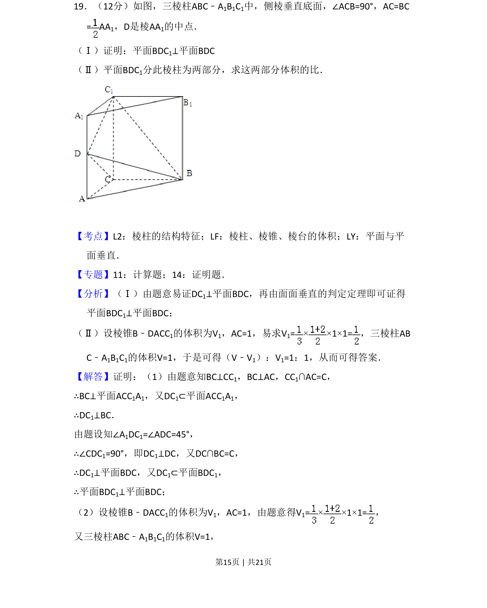
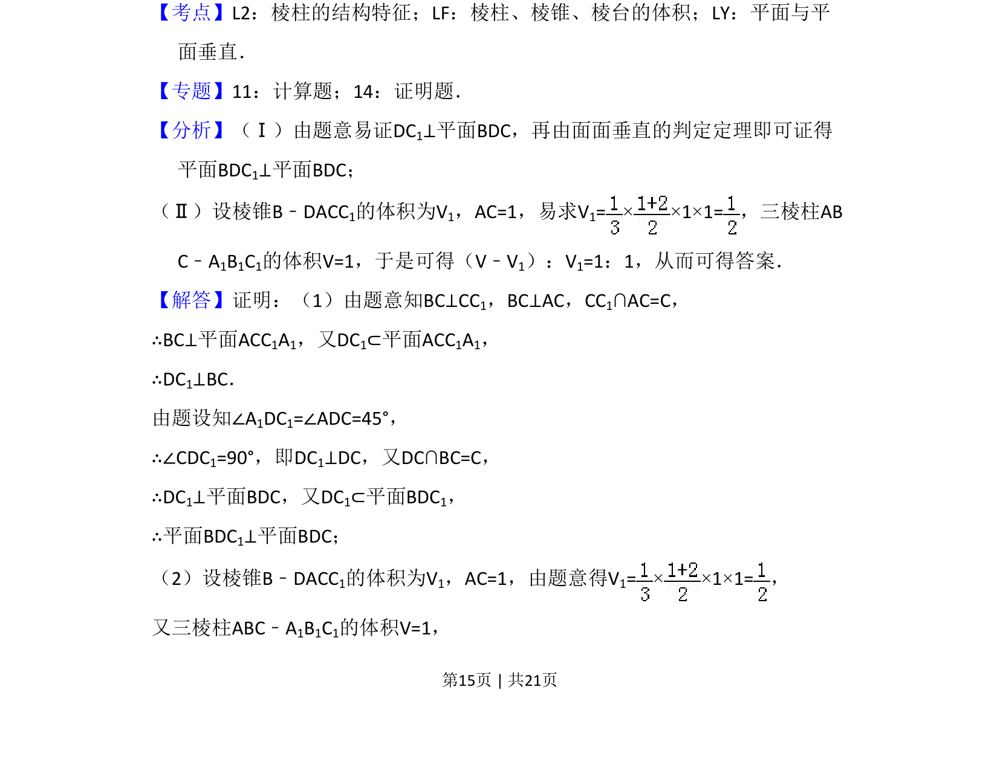
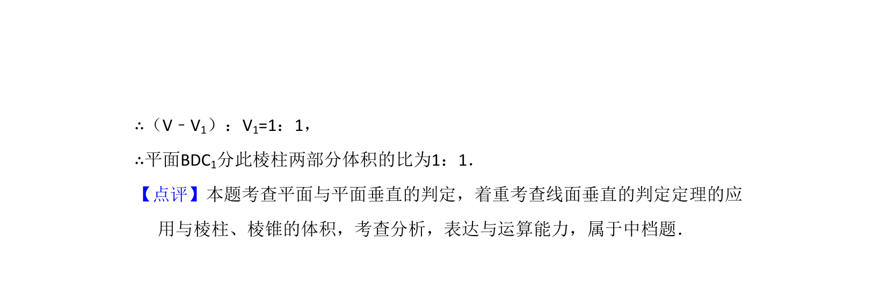

## 题面

## 摘要

证明面面垂直关系及棱柱分割后两部分体积比的计算

## 关联考点

- [[935-棱柱结构特征|棱柱结构特征]]
- [[652-体积计算|体积计算]]
- [[1148-面面垂直判定|面面垂直判定]]

## 答案与解析

> 📄 原 PDF 第 15 页：`素材/真题/吉林/2008-2024·（吉林）数学高考真题/2012年高考数学试卷（文）（新课标）（解析卷）.pdf`
