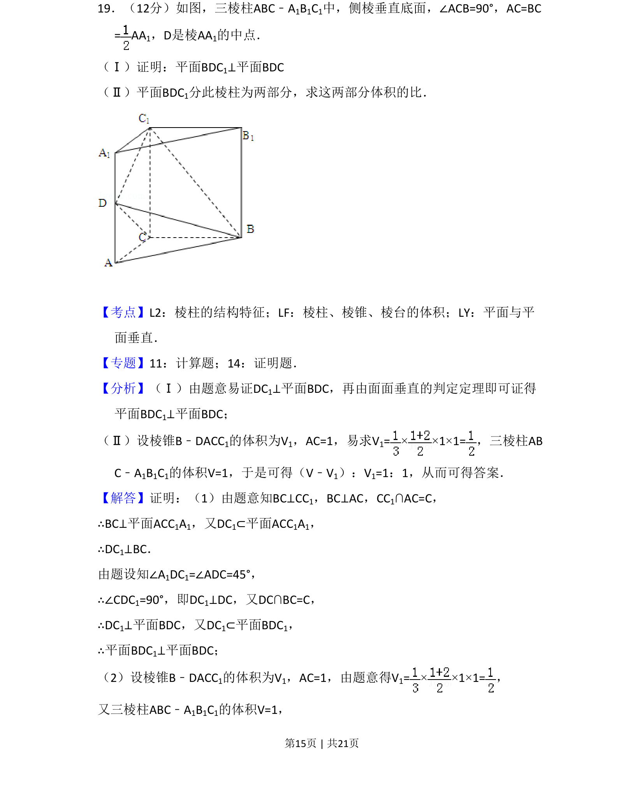
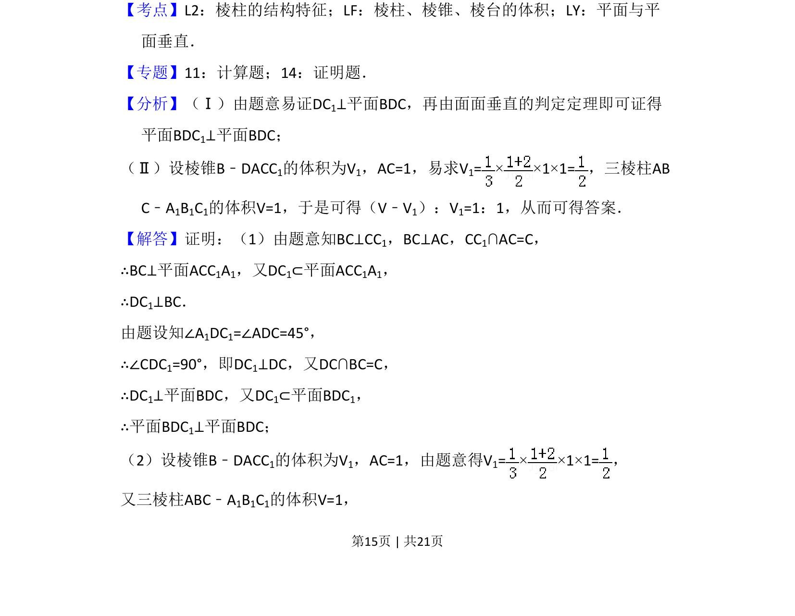
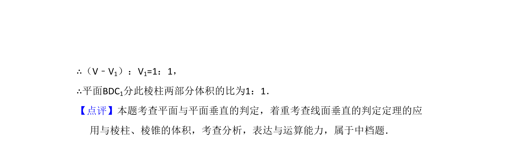

## 题面

## 摘要

证明面面垂直关系及棱柱分割后两部分体积比的计算

## 关联考点

- [[934-棱柱的结构特征|棱柱结构特征]]
- [[652-体积计算|体积计算]]
- [[1149-面面垂直的判定|面面垂直判定]]

## 答案与解析

> 📄 原 PDF 第 15 页：`素材/真题/吉林/2008-2024·（吉林）数学高考真题/2012年高考数学试卷（文）（新课标）（解析卷）.pdf`

<!-- 题干文本-start -->
## 题干文本
19．（12分）如图，三棱柱ABC﹣A1B1C1中，侧棱垂直底面，∠ACB=90°，AC=BC
= AA 1，D是棱AA1的中点．
（Ⅰ）证明：平面BDC1⊥平面BDC
（Ⅱ）平面BDC1分此棱柱为两部分，求这两部分体积的比．
<!-- 题干文本-end -->

<!-- 解析文本-start -->
## 解析文本
【考点】L2：棱柱的结构特征；LF：棱柱、棱锥、棱台的体积；LY：平面与平
面垂直．菁优网版权所有
【专题】11：计算题；14：证明题．
【分析】（Ⅰ）由题意易证DC1⊥平面BDC，再由面面垂直的判定定理即可证得
平面BDC1⊥平面BDC；
（Ⅱ）设棱锥B﹣DACC1的体积为V1，AC=1，易求V1=× ×1×1=，三棱柱AB
C﹣A1B1C1的体积V=1，于是可得（V﹣V1）：V1=1：1，从而可得答案．
【解答】证明：（1）由题意知BC⊥CC1，BC⊥AC，CC1∩AC=C，
∴BC⊥平面ACC1A1，又DC1⊂平面ACC1A1，
∴DC1⊥BC．
由题设知∠A1DC1=∠ADC=45°，
∴∠CDC1=90°，即DC1⊥DC，又DC∩BC=C，
∴DC1⊥平面BDC，又DC1⊂平面BDC1，
∴平面BDC1⊥平面BDC；
（2）设棱锥B﹣DACC1的体积为V1，AC=1，由题意得V1=× ×1×1=，
又三棱柱ABC﹣A1B1C1的体积V=1，
<!-- 解析文本-end -->
