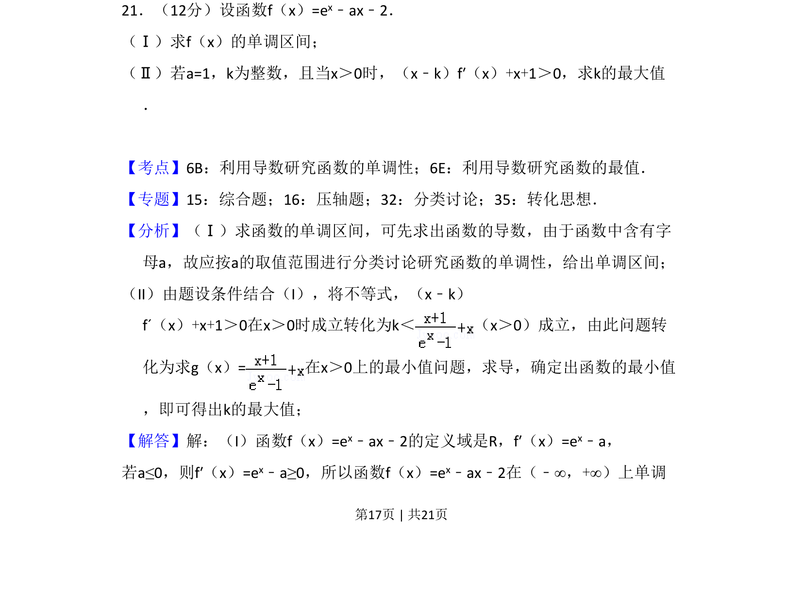

## 题面

## 摘要

本题考查含参数函数的单调区间求法及利用导数解决不等式恒成立问题，并求参数最值。

## 关联考点

- [[利用导数研究函数的单调性]]
- [[利用导数研究函数的最值]]
- [[424-参数分类讨论|分类讨论]]
- [[转化思想]]

## 答案与解析

> 📄 原 PDF 第 17 页：`素材/真题/吉林/2008-2024·（吉林）数学高考真题/2012年高考数学试卷（文）（新课标）（解析卷）.pdf`
