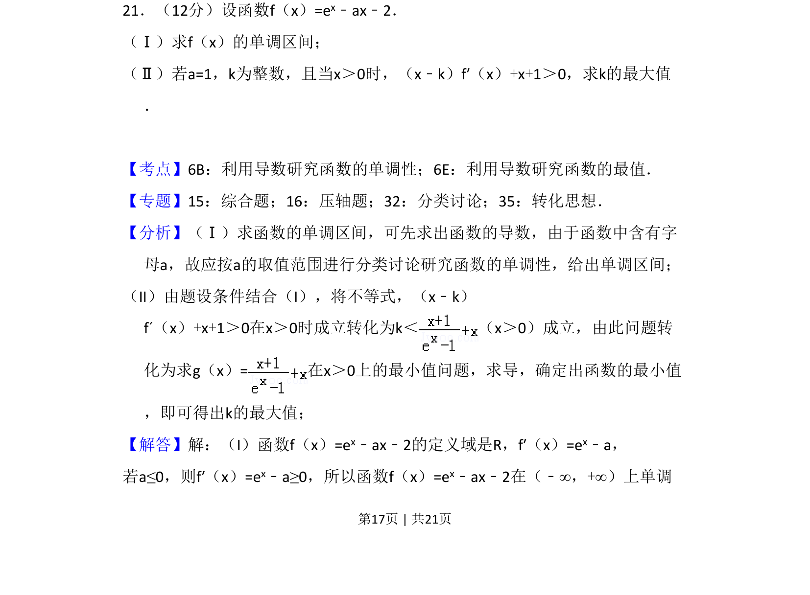
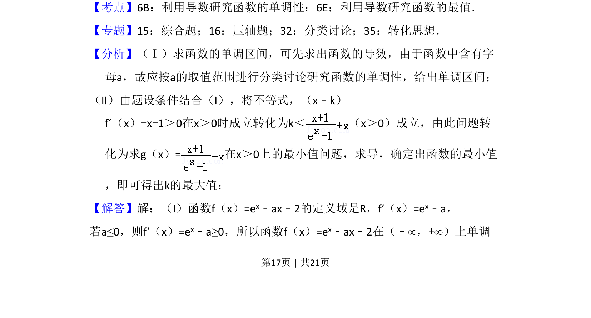
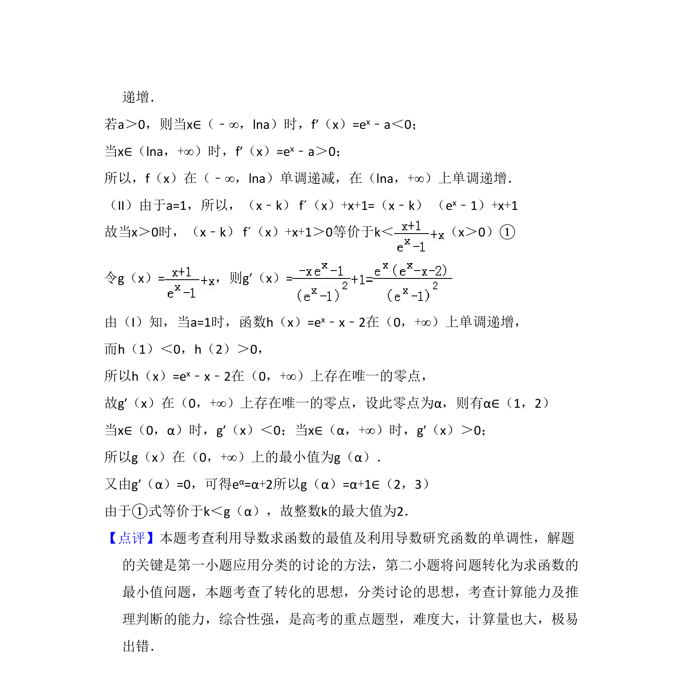

## 题面

## 摘要

本题考查含参数函数的单调区间求法及利用导数解决不等式恒成立问题，并求参数最值。

## 关联考点

- [[705-利用导数研究函数的单调性|利用导数研究函数的单调性]]
- [[706-利用导数研究函数的最值|利用导数研究函数的最值]]
- [[424-参数分类讨论|分类讨论]]
- [[1125-转化思想|转化思想]]

## 答案与解析

> 📄 原 PDF 第 17 页：`素材/真题/吉林/2008-2024·（吉林）数学高考真题/2012年高考数学试卷（文）（新课标）（解析卷）.pdf`

<!-- 题干文本-start -->
## 题干文本
21．（12分）设函数f（x）=ex﹣ax﹣2．
（Ⅰ）求f（x）的单调区间；
（Ⅱ）若a=1，k为整数，且当x＞0时，（x﹣k）f′（x）+x+1＞0，求k的最大值
．
<!-- 题干文本-end -->

<!-- 解析文本-start -->
## 解析文本
【考点】6B：利用导数研究函数的单调性；6E：利用导数研究函数的最值．菁优网版权所有
【专题】15：综合题；16：压轴题；32：分类讨论；35：转化思想．
【分析】（Ⅰ）求函数的单调区间，可先求出函数的导数，由于函数中含有字
母a，故应按a的取值范围进行分类讨论研究函数的单调性，给出单调区间；
（II）由题设条件结合（I），将不等式，（x﹣k） 
f´（x）+x+1＞0在x＞0时成立转化为k＜ （x＞0）成立，由此问题转
化为求g（x）=在x＞0上的最小值问题，求导，确定出函数的最小值
，即可得出k的最大值；
【解答】解：（I）函数f（x）=ex﹣ax﹣2的定义域是R，f′（x）=ex﹣a，
若a≤0，则f′（x）=ex﹣a≥0，所以函数f（x）=ex﹣ax﹣2在（﹣∞，+∞）上单调
<!-- 解析文本-end -->
