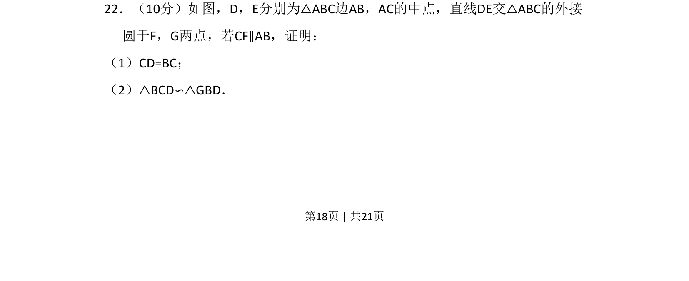
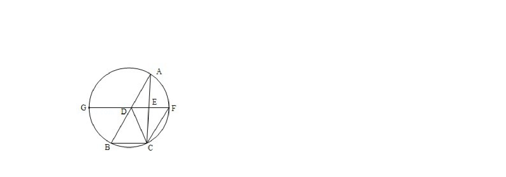
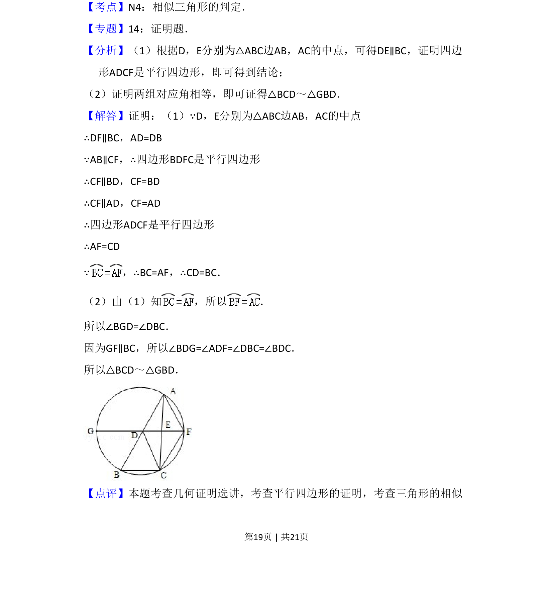
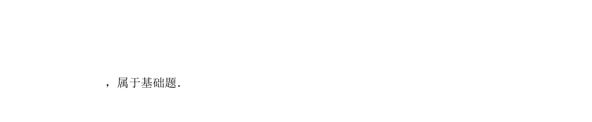

## 题面

## 摘要

几何证明题，利用三角形中位线和平行线及外接圆性质证明线段等长与三角形相似。

## 关联考点

- [[617-三角形中位线定理|三角形中位线定理]]
- [[850-平行线性质|平行线性质]]
- [[773-圆内接四边形性质|圆内接四边形性质]]
- [[1035-相似三角形判定|相似三角形判定]]

## 答案与解析

> 📄 原 PDF 第 18 页：`素材/真题/吉林/2008-2024·（吉林）数学高考真题/2012年高考数学试卷（文）（新课标）（解析卷）.pdf`
