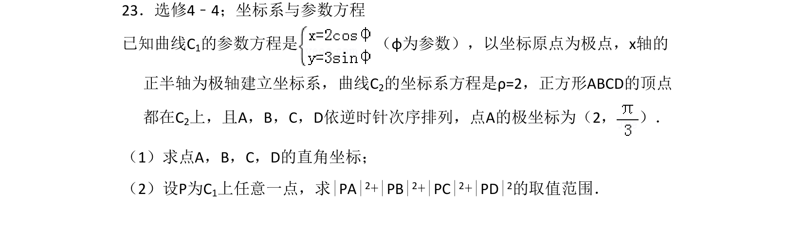
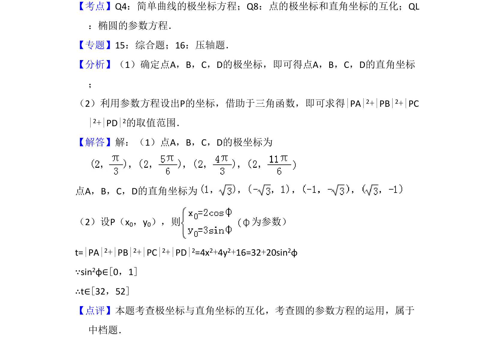

## 题面

## 摘要

本题考查极坐标与直角坐标的互化，以及椭圆的参数方程在最值问题中的应用。

## 关联考点

- [[921-极坐标与直角坐标互化|极坐标与直角坐标互化]]
- [[565-椭圆的参数方程|椭圆的参数方程]]
- [[1124-距离平方和取值范围|距离平方和取值范围]]

## 答案与解析

> 📄 原 PDF 第 20 页：`素材/真题/吉林/2008-2024·（吉林）数学高考真题/2012年高考数学试卷（文）（新课标）（解析卷）.pdf`
