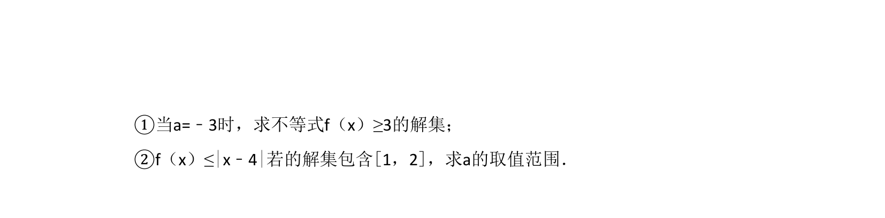
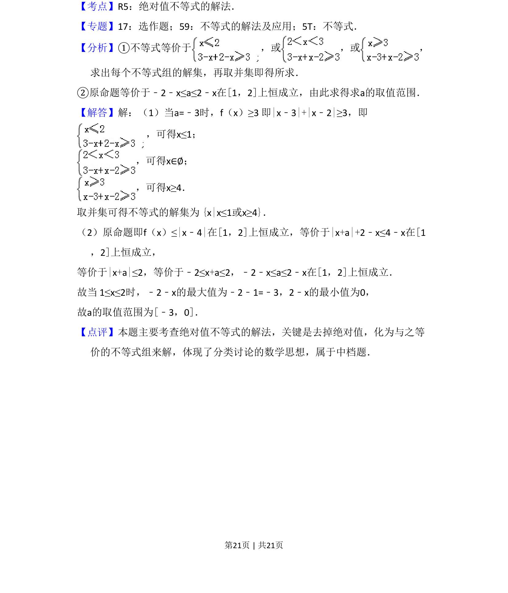

## 题面

## 摘要

含参绝对值函数最值或不等式恒成立问题

## 关联考点

- [[585-绝对值函数|绝对值函数]]
- [[290-分段函数|分段函数]]
- [[594-参数讨论|参数讨论]]
- [[286-函数的最值|最值]]

## 答案与解析

> 📄 原 PDF 第 20 页：`素材/真题/吉林/2008-2024·（吉林）数学高考真题/2012年高考数学试卷（文）（新课标）（解析卷）.pdf`
