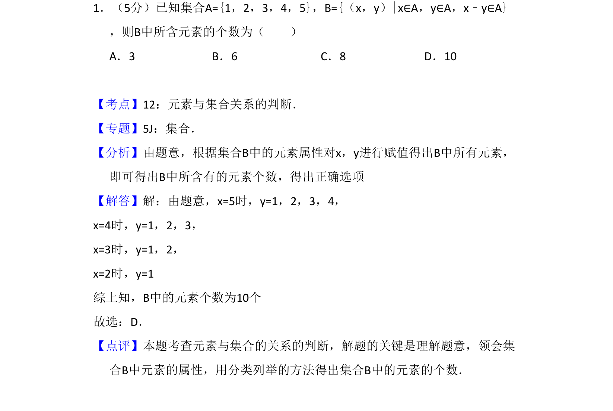
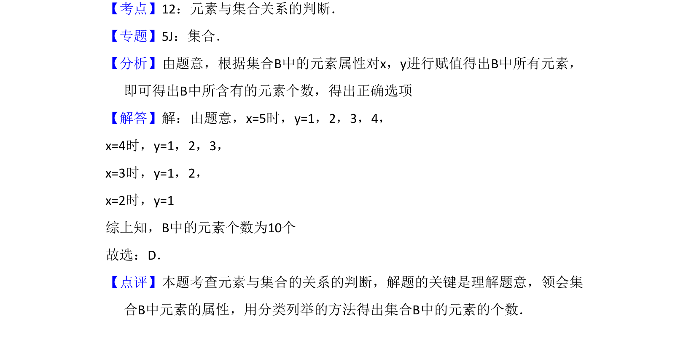

## 题面

## 摘要

本题考查通过集合描述法确定元素个数，需分类列举满足条件的x、y值。

## 关联考点

- [[元素与集合关系的判断]]
- [[集合的表示法]]
- [[424-参数分类讨论|分类讨论]]

## 答案与解析

> 📄 原 PDF 第 1 页：`素材/真题/吉林/2008-2024·（吉林）数学高考真题/2012年高考数学试卷（理）（新课标）（解析卷）.pdf`
