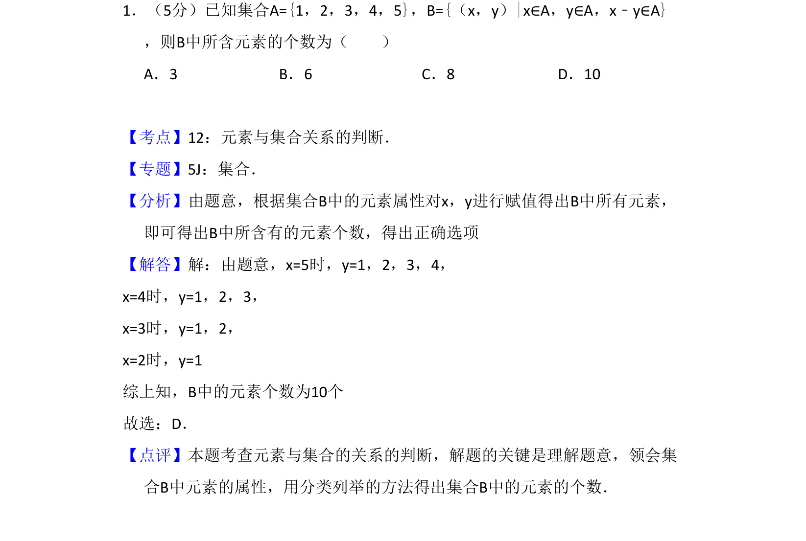
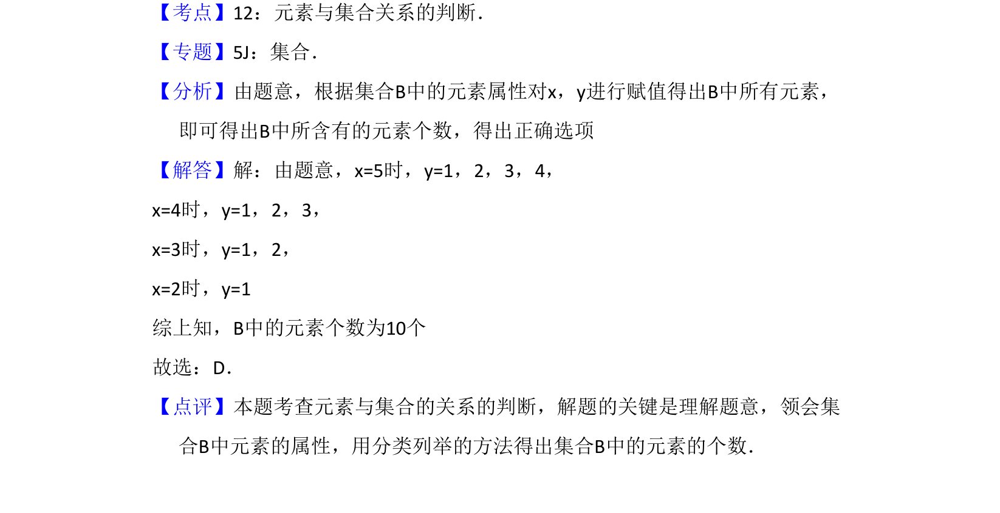

## 题面

## 摘要

本题考查通过集合描述法确定元素个数，需分类列举满足条件的x、y值。

## 关联考点

- [[659-元素与集合关系的判断|元素与集合关系的判断]]
- [[1140-集合的表示法|集合的表示法]]
- [[424-参数分类讨论|分类讨论]]

## 答案与解析

> 📄 原 PDF 第 1 页：`素材/真题/吉林/2008-2024·（吉林）数学高考真题/2012年高考数学试卷（理）（新课标）（解析卷）.pdf`

<!-- 题干文本-start -->
## 题干文本
1．（5分）已知集合A={1，2，3，4，5}，B={（x，y）|x∈A，y∈A，x﹣y∈A}
，则B中所含元素的个数为（　　）
A．3 B．6 C．8 D．10
<!-- 题干文本-end -->

<!-- 解析文本-start -->
## 解析文本
【考点】12：元素与集合关系的判断．菁优网版权所有
【专题】5J：集合．
【分析】由题意，根据集合B中的元素属性对x，y进行赋值得出B中所有元素，
即可得出B中所含有的元素个数，得出正确选项
【解答】解：由题意，x=5时，y=1，2，3，4，
x=4时，y=1，2，3，
x=3时，y=1，2，
x=2时，y=1
综上知，B中的元素个数为10个
故选：D．
【点评】本题考查元素与集合的关系的判断，解题的关键是理解题意，领会集
合B中元素的属性，用分类列举的方法得出集合B中的元素的个数．
<!-- 解析文本-end -->
