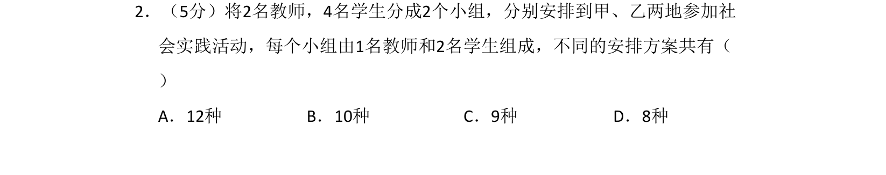

## 题面

## 摘要

将2名教师和4名学生分成两组，每组1名教师和2名学生，再分配到两地，求不同方案数。

## 关联考点

- [[487-排列概念|排列]]
- [[505-组合概念|组合]]
- [[计数原理]]
- [[分组分配]]

## 答案与解析

> 📄 原 PDF 第 1 页：`素材/真题/吉林/2008-2024·（吉林）数学高考真题/2012年高考数学试卷（理）（新课标）（解析卷）.pdf`
