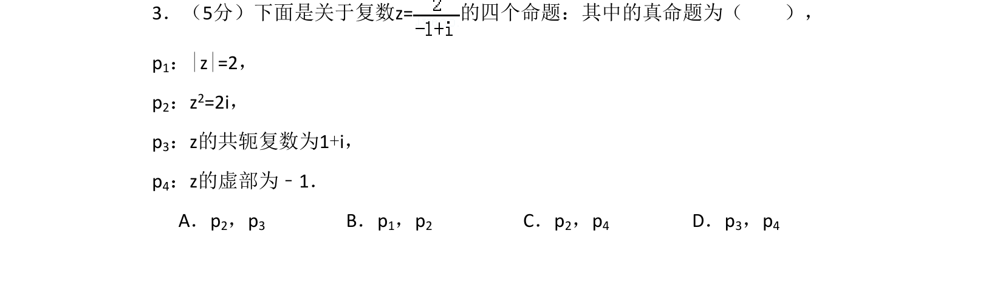
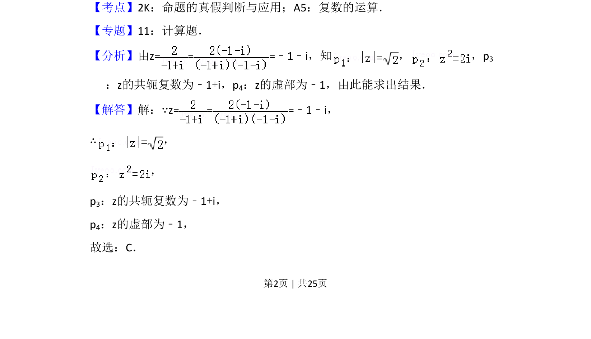
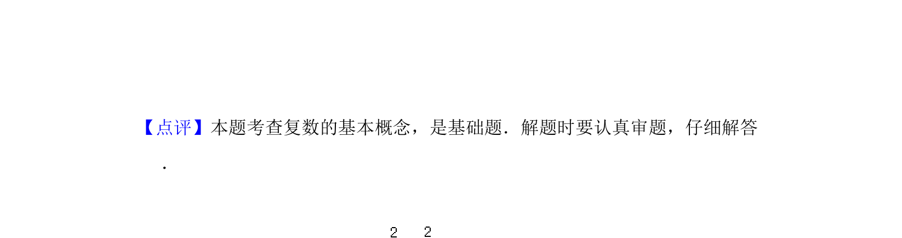

## 题面

## 摘要

该题考查复数的四则运算、共轭复数、虚部等概念，要求判断命题真假。

## 关联考点

- [[809-复数的运算|复数的运算]]
- [[763-命题的真假判断|命题的真假判断]]
- [[534-共轭复数|共轭复数]]
- [[808-复数的虚部|复数的虚部]]

## 答案与解析

> 📄 原 PDF 第 2 页：`素材/真题/吉林/2008-2024·（吉林）数学高考真题/2012年高考数学试卷（理）（新课标）（解析卷）.pdf`
