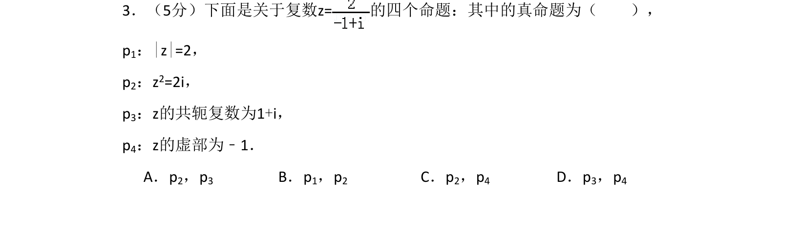
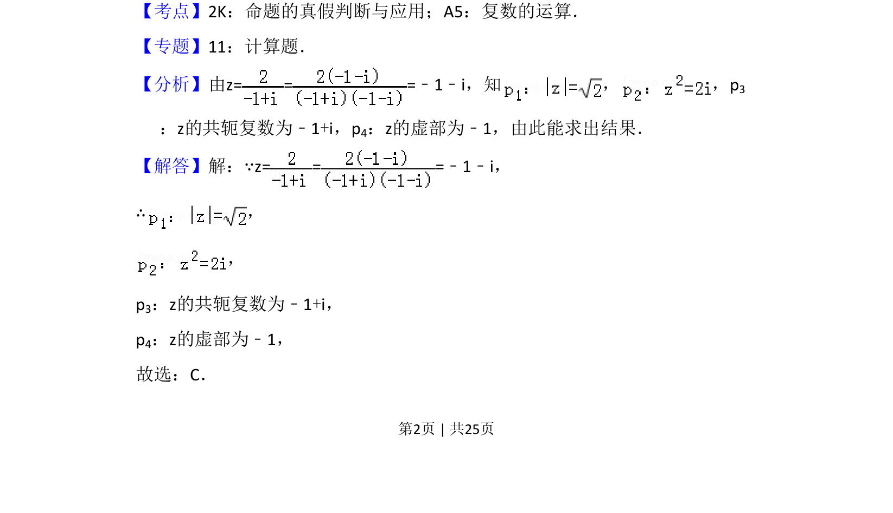
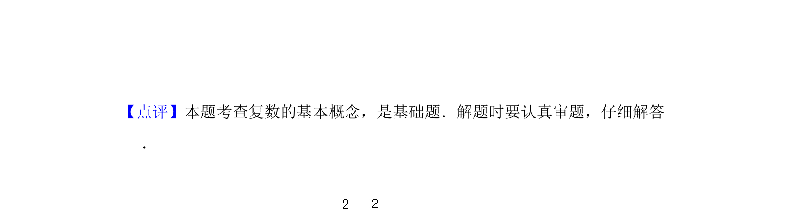

## 题面

## 摘要

该题考查复数的四则运算、共轭复数、虚部等概念，要求判断命题真假。

## 关联考点

- [[811-复数运算|复数的运算]]
- [[765-命题真假判断|命题的真假判断]]
- [[534-共轭复数|共轭复数]]
- [[807-复数的虚部|复数的虚部]]

## 答案与解析

> 📄 原 PDF 第 2 页：`素材/真题/吉林/2008-2024·（吉林）数学高考真题/2012年高考数学试卷（理）（新课标）（解析卷）.pdf`

<!-- 题干文本-start -->
## 题干文本
3．（5分）下面是关于复数z=的四个命题：其中的真命题为（　　），
p1：|z|=2，
p2：z2=2i，
p3：z的共轭复数为1+i，
p4：z的虚部为﹣1．
A．p2，p3 B．p1，p2 C．p2，p4 D．p3，p4
<!-- 题干文本-end -->

<!-- 解析文本-start -->
## 解析文本
【考点】2K：命题的真假判断与应用；A5：复数的运算．菁优网版权所有
【专题】11：计算题．
【分析】由z= = =﹣1﹣i，知 ， ，p 3
：z的共轭复数为﹣1+i，p4：z的虚部为﹣1，由此能求出结果．
【解答】解：∵z= = =﹣1﹣i，
∴，
，
p3：z的共轭复数为﹣1+i，
p4：z的虚部为﹣1，
故选：C．
<!-- 解析文本-end -->
