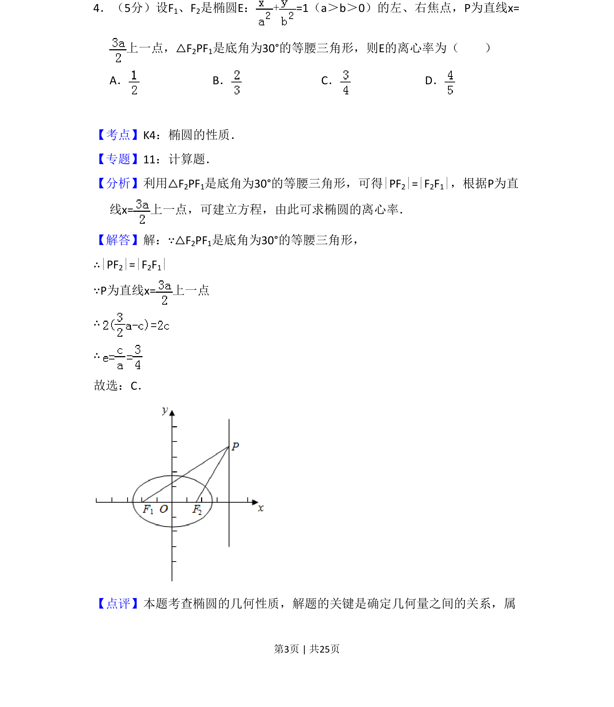
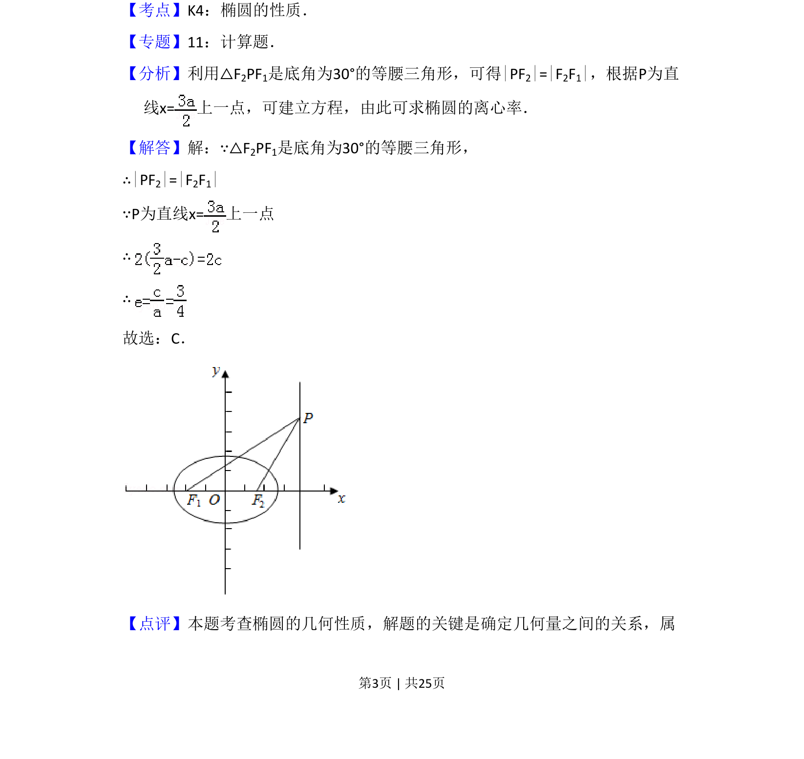

## 题面

## 摘要

椭圆离心率的求解，通过等腰三角形条件建立几何关系方程。

## 关联考点

- [[945-椭圆的性质|椭圆的性质]]
- [[391-椭圆离心率|离心率]]
- [[171-等腰三角形性质|等腰三角形]]

## 答案与解析

> 📄 原 PDF 第 3 页：`素材/真题/吉林/2008-2024·（吉林）数学高考真题/2012年高考数学试卷（理）（新课标）（解析卷）.pdf`
