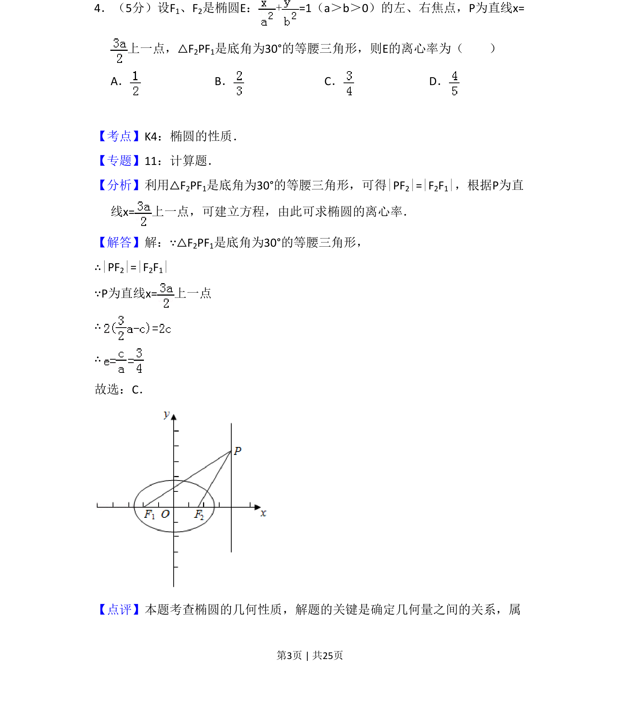
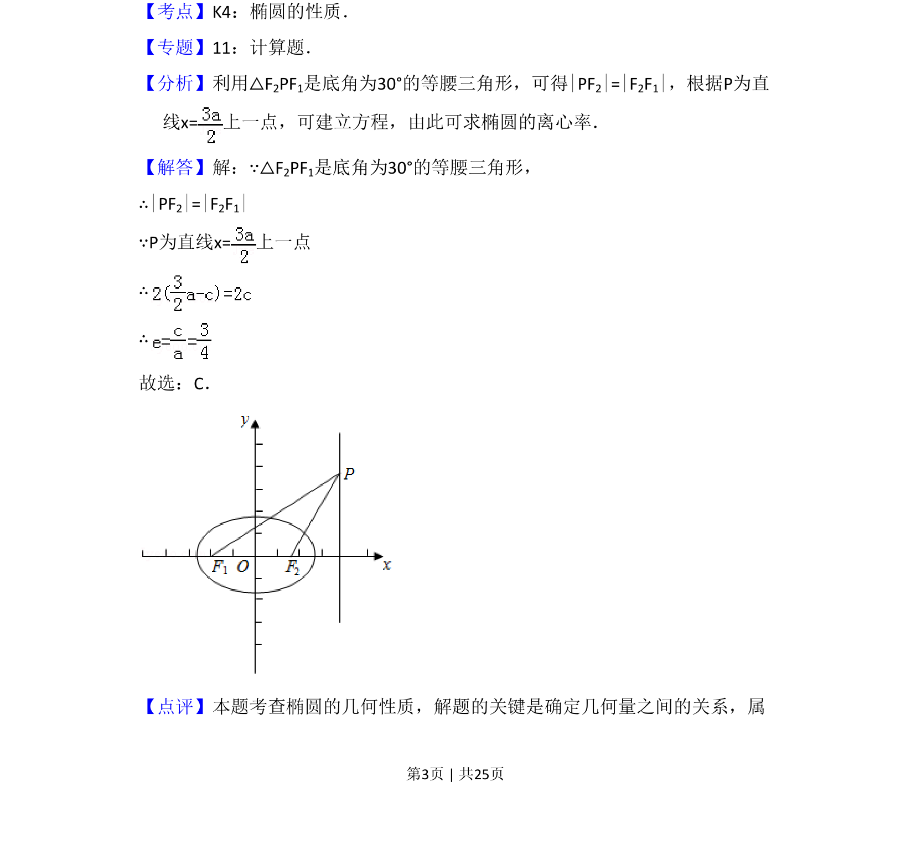

## 题面

## 摘要

椭圆离心率的求解，通过等腰三角形条件建立几何关系方程。

## 关联考点

- [[944-椭圆的性质|椭圆的性质]]
- [[391-椭圆离心率|离心率]]
- [[171-等腰三角形性质|等腰三角形]]

## 答案与解析

> 📄 原 PDF 第 3 页：`素材/真题/吉林/2008-2024·（吉林）数学高考真题/2012年高考数学试卷（理）（新课标）（解析卷）.pdf`

<!-- 题干文本-start -->
## 题干文本
4．（5分）设F1、F2是椭圆E：+=1（a＞b＞0）的左、右焦点，P为直线x=
上一点，△F2PF1是底角为30°的等腰三角形，则E的离心率为（　　）
A．B．C．D．
<!-- 题干文本-end -->

<!-- 解析文本-start -->
## 解析文本
【考点】K4：椭圆的性质．菁优网版权所有
【专题】11：计算题．
【分析】利用△F2PF1是底角为30°的等腰三角形，可得|PF2|=|F2F1|，根据P为直
线x=上一点，可建立方程，由此可求椭圆的离心率．
【解答】解：∵△F2PF1是底角为30°的等腰三角形，
∴|PF2|=|F2F1|
∵P为直线x=上一点
∴
∴
故选：C．
【点评】本题考查椭圆的几何性质，解题的关键是确定几何量之间的关系，属
<!-- 解析文本-end -->
