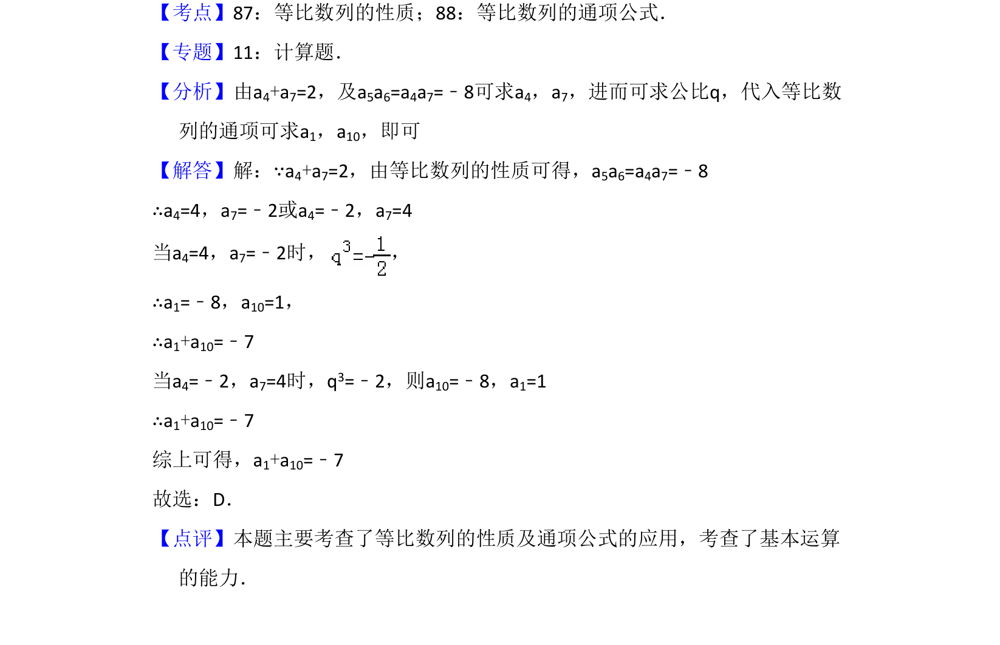

## 题面

## 摘要

该题考查等比数列的性质及通项公式的应用，通过已知条件求指定项的和。

## 关联考点

- [[413-等比数列性质|等比数列的性质]]
- [[1070-等比数列通项公式|等比数列的通项公式]]

## 答案与解析

> 📄 原 PDF 第 4 页：`素材/真题/吉林/2008-2024·（吉林）数学高考真题/2012年高考数学试卷（理）（新课标）（解析卷）.pdf`

<!-- 题干文本-start -->
## 题干文本
5．（5分）已知{an}为等比数列，a4+a7=2，a5a6=﹣8，则a1+a10=（　　）
A．7 B．5 C．﹣5 D．﹣7
<!-- 题干文本-end -->

<!-- 解析文本-start -->
## 解析文本
【考点】87：等比数列的性质；88：等比数列的通项公式．菁优网版权所有
【专题】11：计算题．
【分析】由a4+a7=2，及a5a6=a4a7=﹣8可求a4，a7，进而可求公比q，代入等比数
列的通项可求a1，a10，即可
【解答】解：∵a4+a7=2，由等比数列的性质可得，a5a6=a4a7=﹣8
∴a4=4，a7=﹣2或a4=﹣2，a7=4
当a4=4，a7=﹣2时， ，
∴a1=﹣8，a10=1，
∴a1+a10=﹣7
当a4=﹣2，a7=4时，q3=﹣2，则a10=﹣8，a1=1
∴a1+a10=﹣7
综上可得，a1+a10=﹣7
故选：D．
【点评】本题主要考查了等比数列的性质及通项公式的应用，考查了基本运算
的能力．
<!-- 解析文本-end -->
