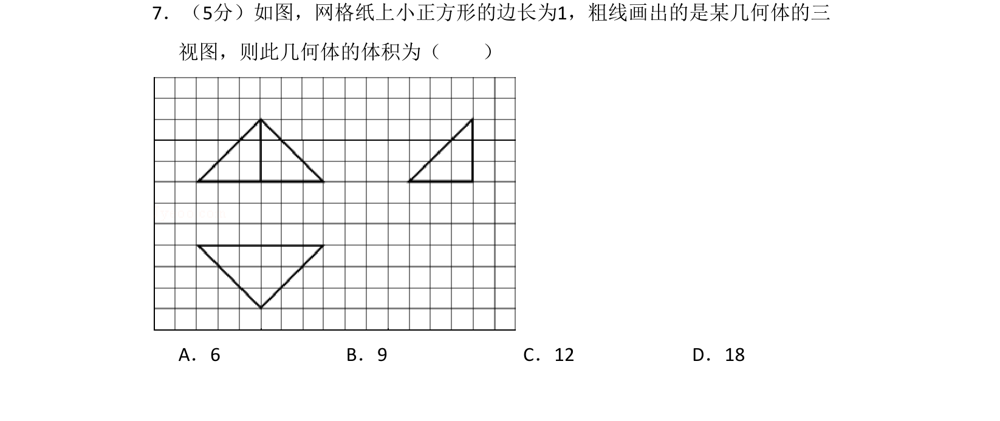
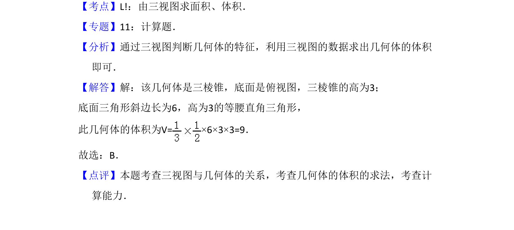

## 题面

## 摘要

由三视图还原几何体并计算其体积，涉及三棱锥体积公式。

## 关联考点

- [[1198-由三视图求面积|由三视图求面积]]
- [[066-体积|体积]]
- [[936-棱锥体积|棱锥的体积]]
- [[1054-空间想象能力|空间想象能力]]

## 答案与解析

> 📄 原 PDF 第 6 页：`素材/真题/吉林/2008-2024·（吉林）数学高考真题/2012年高考数学试卷（理）（新课标）（解析卷）.pdf`

<!-- 题干文本-start -->
## 题干文本
7．（5分）如图，网格纸上小正方形的边长为1，粗线画出的是某几何体的三
视图，则此几何体的体积为（　　）
A．6 B．9 C．12 D．18
<!-- 题干文本-end -->

<!-- 解析文本-start -->
## 解析文本
【考点】L!：由三视图求面积、体积．菁优网版权所有
【专题】11：计算题．
【分析】通过三视图判断几何体的特征，利用三视图的数据求出几何体的体积
即可．
【解答】解：该几何体是三棱锥，底面是俯视图，三棱锥的高为3；
底面三角形斜边长为6，高为3的等腰直角三角形，
此几何体的体积为V=×6×3×3=9．
故选：B．
【点评】本题考查三视图与几何体的关系，考查几何体的体积的求法，考查计
算能力．
<!-- 解析文本-end -->
