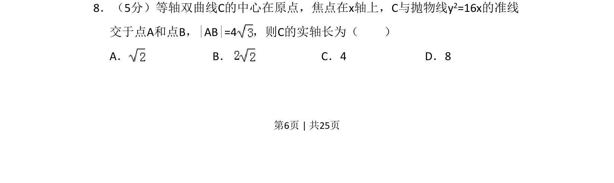
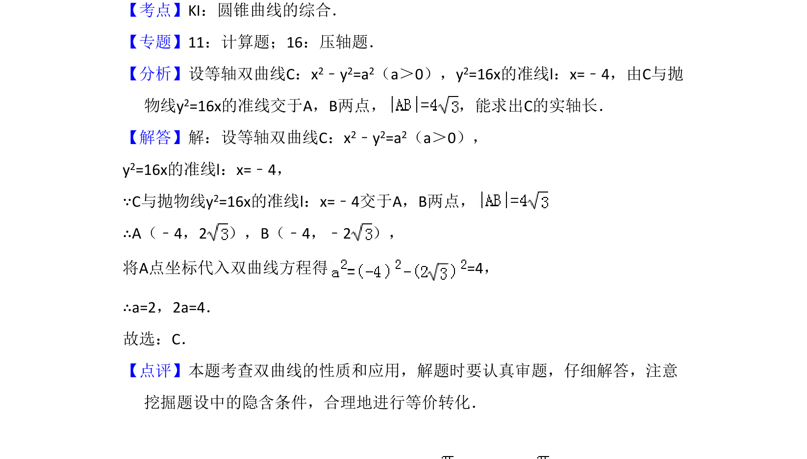

## 题面

## 摘要

等轴双曲线与抛物线准线相交，已知弦长求实轴长。

## 关联考点

- [[367-双曲线几何性质|双曲线性质]]
- [[551-抛物线的准线|抛物线的准线]]
- [[870-弦长计算|弦长计算]]
- [[908-方程联立|方程联立]]

## 答案与解析

> 📄 原 PDF 第 6 页：`素材/真题/吉林/2008-2024·（吉林）数学高考真题/2012年高考数学试卷（理）（新课标）（解析卷）.pdf`
