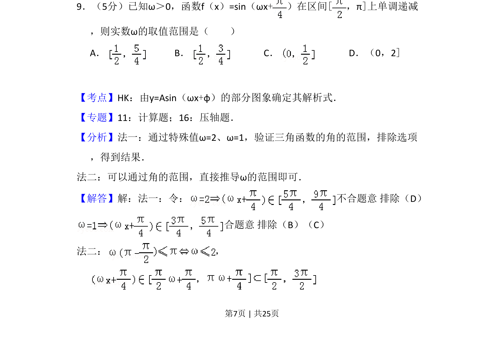
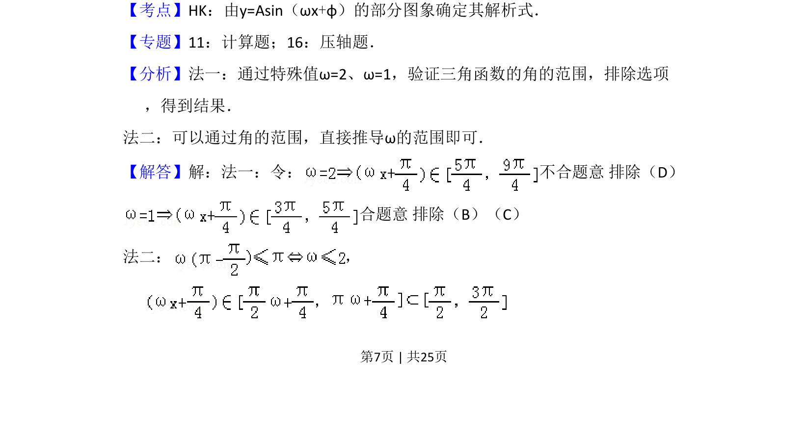
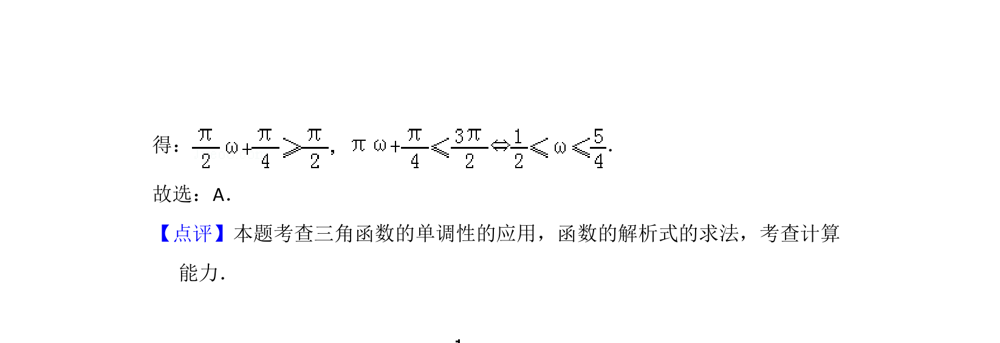

## 题面

## 摘要

本题考查正弦型函数在给定区间内的单调性，通过单调递减条件求参数ω的取值范围。

## 关联考点

- [[正弦函数的单调性]]
- [[由y=Asin(ωx+φ)的部分图象确定解析式]]
- [[参数取值范围]]

## 答案与解析

> 📄 原 PDF 第 7 页：`素材/真题/吉林/2008-2024·（吉林）数学高考真题/2012年高考数学试卷（理）（新课标）（解析卷）.pdf`
