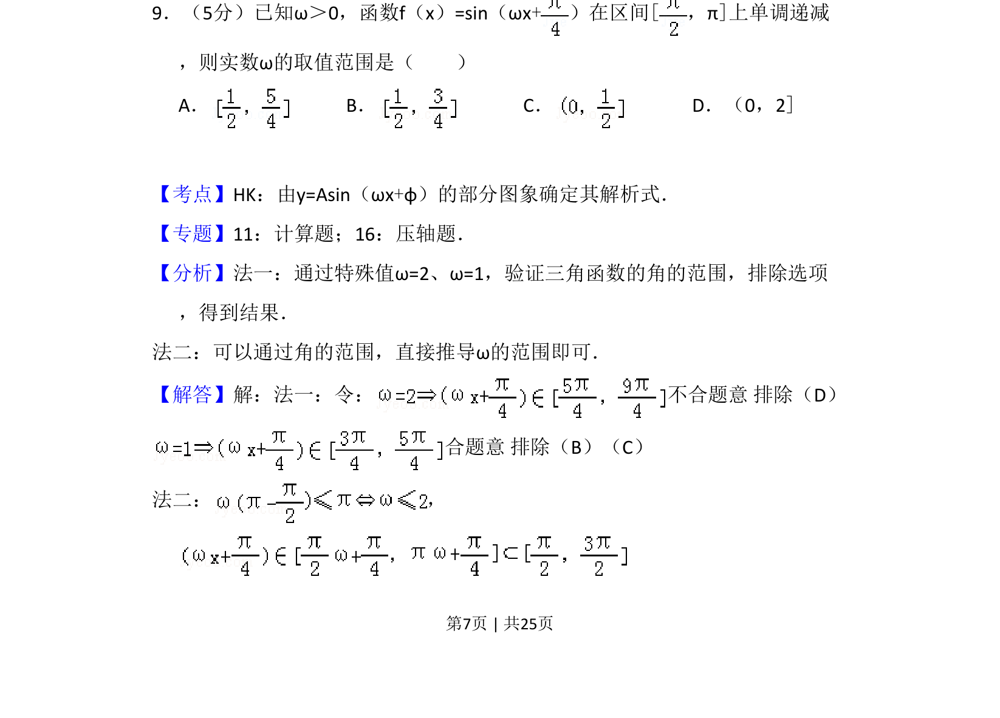
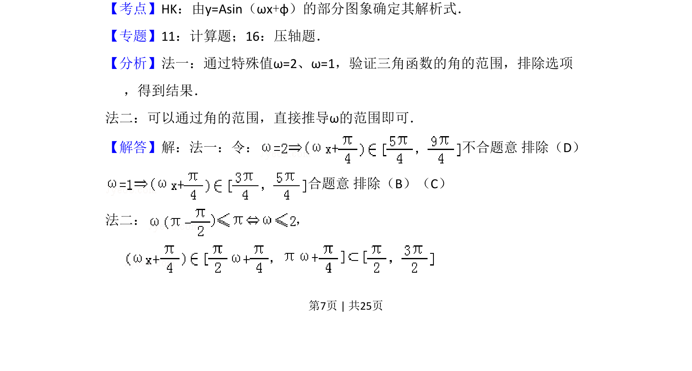
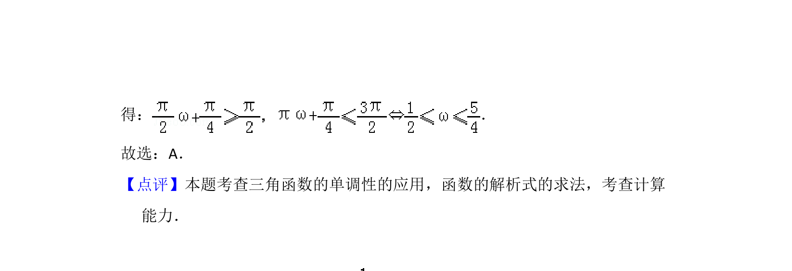

## 题面

## 摘要

本题考查正弦型函数在给定区间内的单调性，通过单调递减条件求参数ω的取值范围。

## 关联考点

- [[961-正弦函数的单调性|正弦函数的单调性]]
- [[995-由y=Asin(ωx+φ)的部分图象确定解析式|由y=Asin(ωx+φ)的部分图象确定解析式]]
- [[721-参数取值范围|参数取值范围]]

## 答案与解析

> 📄 原 PDF 第 7 页：`素材/真题/吉林/2008-2024·（吉林）数学高考真题/2012年高考数学试卷（理）（新课标）（解析卷）.pdf`

<!-- 题干文本-start -->
## 题干文本
9．（5分）已知ω＞0，函数f（x）=sin（ωx+）在区间[，π]上单调递减
，则实数ω的取值范围是（　　）
A．B．C．D．（0，2]
<!-- 题干文本-end -->

<!-- 解析文本-start -->
## 解析文本
【考点】HK：由y=Asin（ωx+φ）的部分图象确定其解析式．菁优网版权所有
【专题】11：计算题；16：压轴题．
【分析】法一：通过特殊值ω=2、ω=1，验证三角函数的角的范围，排除选项
，得到结果．
法二：可以通过角的范围，直接推导ω的范围即可．
【解答】解：法一：令： 不合题意 排除（D）
合题意 排除（B）（C）
法二： ，
<!-- 解析文本-end -->
