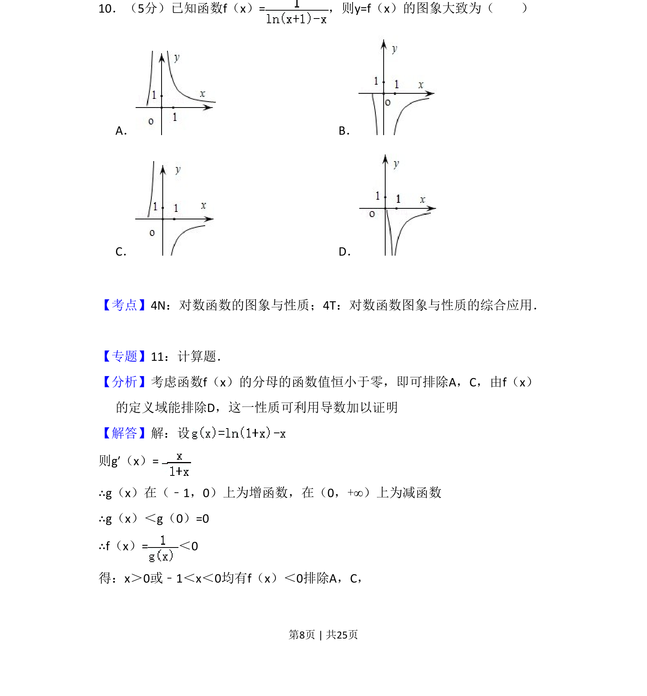
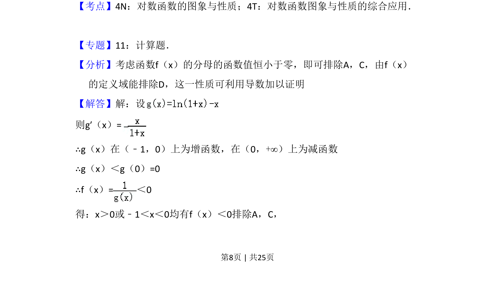
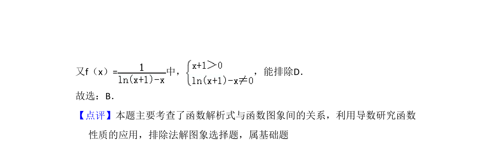

## 题面

## 摘要

本题通过分析函数分母的值域及定义域，结合导数研究函数性质，利用排除法判断函数图象

## 关联考点

- [[830-对数函数的图象与性质|对数函数的图象与性质]]
- [[677-函数图象的判断|函数图象的判断]]
- [[432-导数与函数单调性|导数与函数单调性]]

## 答案与解析

> 📄 原 PDF 第 8 页：`素材/真题/吉林/2008-2024·（吉林）数学高考真题/2012年高考数学试卷（理）（新课标）（解析卷）.pdf`

<!-- 题干文本-start -->
## 题干文本
10．（5分）已知函数f（x）=，则y=f（x）的图象大致为（　　）
A．B．
C．D．
<!-- 题干文本-end -->

<!-- 解析文本-start -->
## 解析文本
【考点】4N：对数函数的图象与性质；4T：对数函数图象与性质的综合应用．菁优网版权
所有
【专题】11：计算题．
【分析】考虑函数f（x）的分母的函数值恒小于零，即可排除A，C，由f（x）
的定义域能排除D，这一性质可利用导数加以证明
【解答】解：设
则g′（x）=
∴g（x）在（﹣1，0）上为增函数，在（0，+∞）上为减函数
∴g（x）＜g（0）=0
∴f（x）=＜0
得：x＞0或﹣1＜x＜0均有f（x）＜0排除A，C，
<!-- 解析文本-end -->
