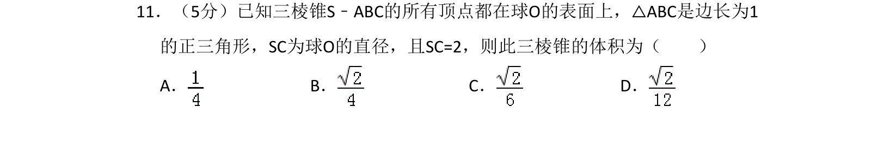
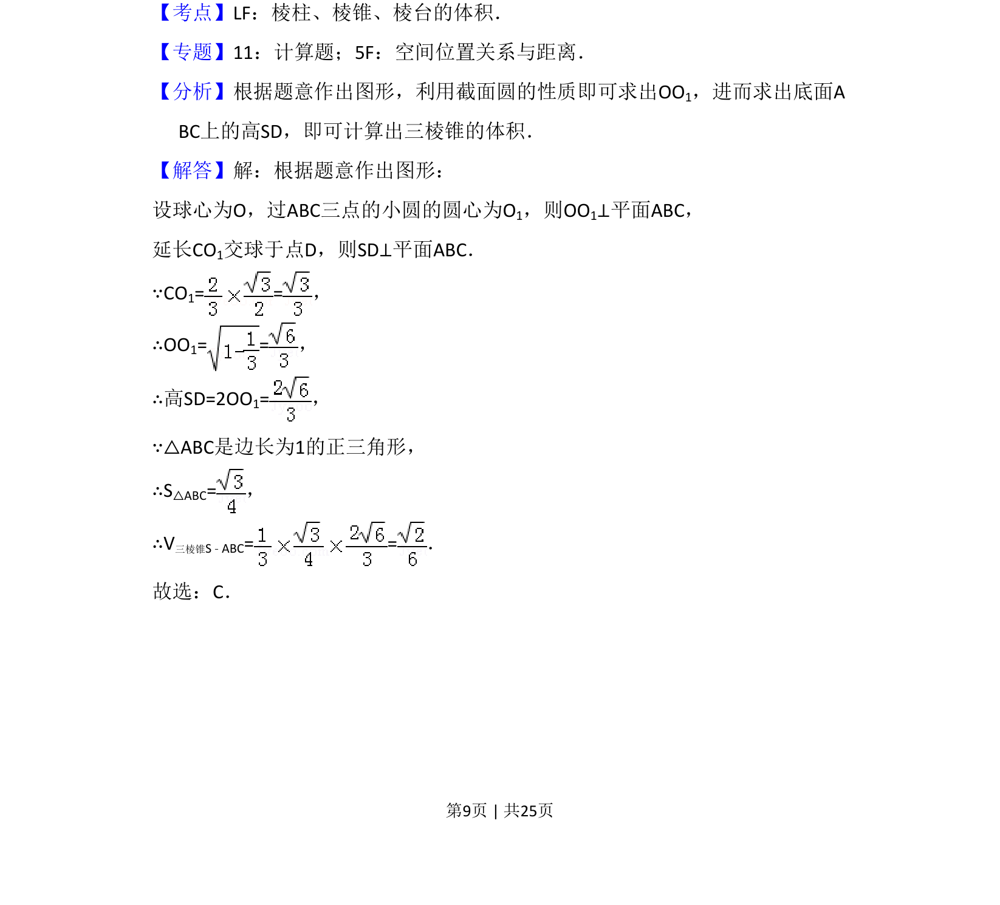
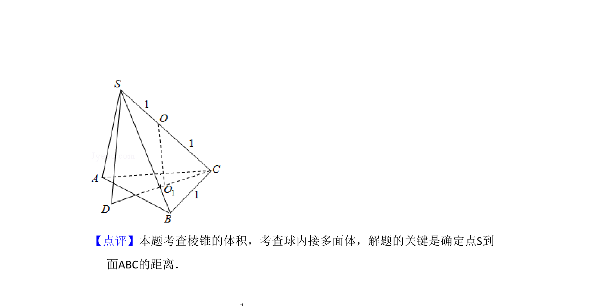

## 题面

## 摘要

计算球内接三棱锥的体积，利用球心到截面距离求高。

## 关联考点

- [[937-棱锥体积|棱锥体积]]
- [[1198-球内接几何体|球内接几何体]]
- [[874-截面圆性质|截面圆性质]]

## 答案与解析

> 📄 原 PDF 第 9 页：`素材/真题/吉林/2008-2024·（吉林）数学高考真题/2012年高考数学试卷（理）（新课标）（解析卷）.pdf`
