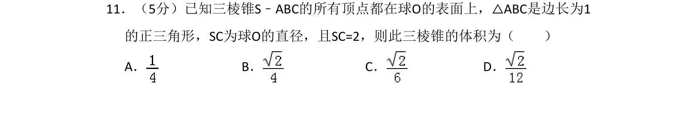
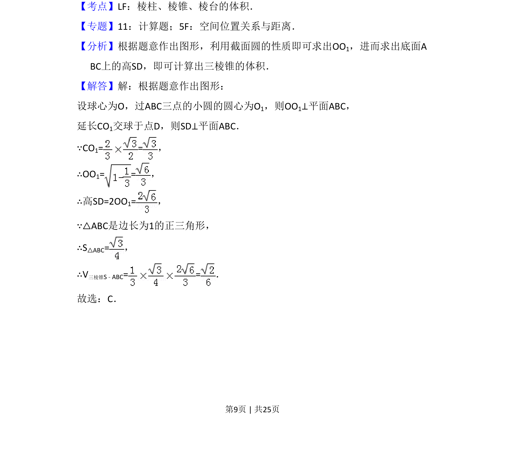
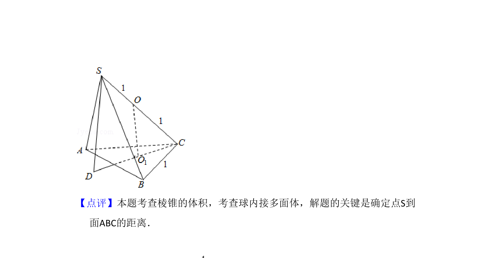

## 题面

## 摘要

计算球内接三棱锥的体积，利用球心到截面距离求高。

## 关联考点

- [[936-棱锥体积|棱锥体积]]
- [[1197-球内接几何体|球内接几何体]]
- [[873-截面圆性质|截面圆性质]]

## 答案与解析

> 📄 原 PDF 第 9 页：`素材/真题/吉林/2008-2024·（吉林）数学高考真题/2012年高考数学试卷（理）（新课标）（解析卷）.pdf`

<!-- 题干文本-start -->
## 题干文本
11．（5分）已知三棱锥S﹣ABC的所有顶点都在球O的表面上，△ABC是边长为1
的正三角形，SC为球O的直径，且SC=2，则此三棱锥的体积为（　　）
A．B．C．D．
<!-- 题干文本-end -->

<!-- 解析文本-start -->
## 解析文本
【考点】LF：棱柱、棱锥、棱台的体积．菁优网版权所有
【专题】11：计算题；5F：空间位置关系与距离．
【分析】根据题意作出图形，利用截面圆的性质即可求出OO1，进而求出底面A
BC上的高SD，即可计算出三棱锥的体积．
【解答】解：根据题意作出图形：
设球心为O，过ABC三点的小圆的圆心为O1，则OO1⊥平面ABC，
延长CO1交球于点D，则SD⊥平面ABC．
∵CO1= =，
∴OO1= =，
∴高SD=2OO1=，
∵△ABC是边长为1的正三角形，
∴S△ABC=，
∴V三棱锥S﹣ABC= =．
故选：C．
<!-- 解析文本-end -->
