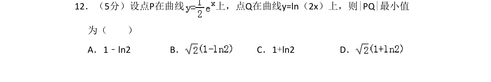
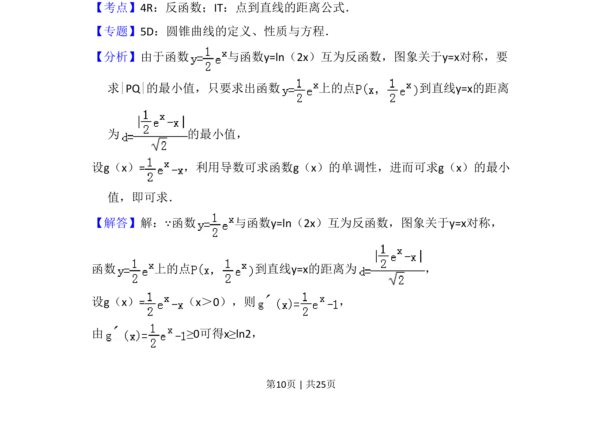
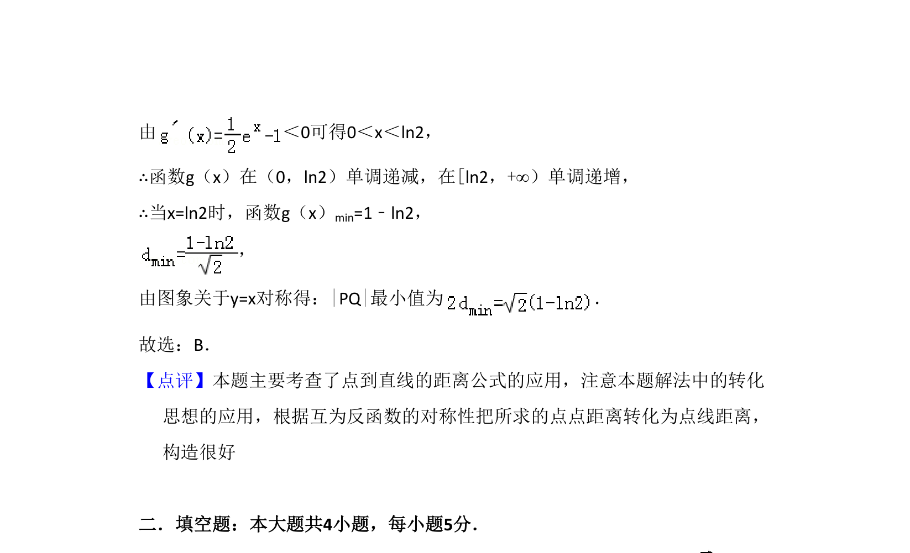

## 题面

## 摘要

本题研究互为反函数的两曲线上的点间最小距离，利用对称性转化为点到直线距离并借助导数求最值。

## 关联考点

- [[292-反函数|反函数]]
- [[392-点到直线距离公式|点到直线距离公式]]
- [[841-导数求最值|导数求最值]]

## 答案与解析

> 📄 原 PDF 第 10 页：`素材/真题/吉林/2008-2024·（吉林）数学高考真题/2012年高考数学试卷（理）（新课标）（解析卷）.pdf`
