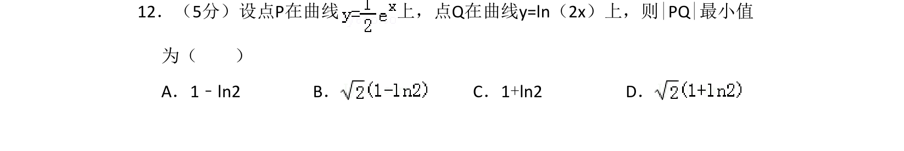
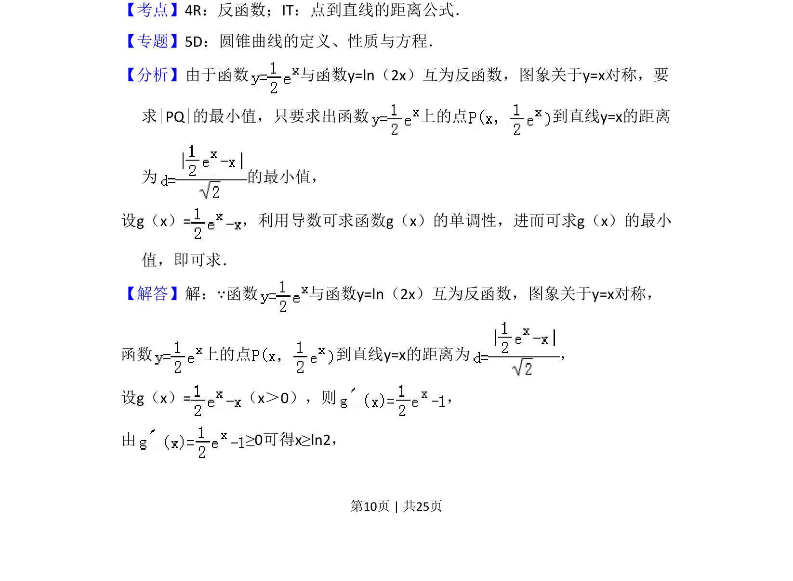
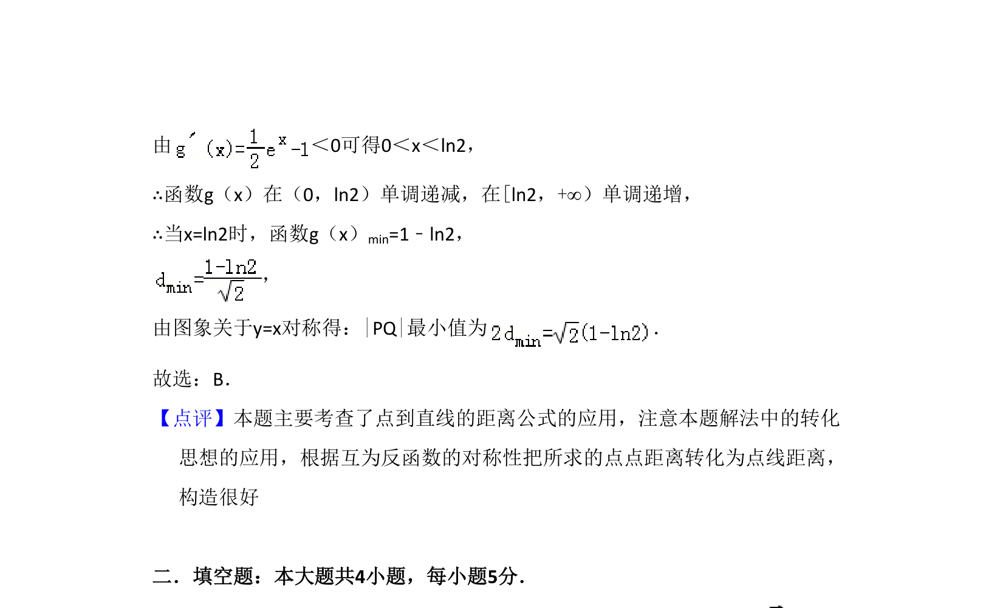

## 题面

## 摘要

本题研究互为反函数的两曲线上的点间最小距离，利用对称性转化为点到直线距离并借助导数求最值。

## 关联考点

- [[292-反函数|反函数]]
- [[570-点到直线的距离公式|点到直线距离公式]]
- [[840-导数求最值|导数求最值]]

## 答案与解析

> 📄 原 PDF 第 10 页：`素材/真题/吉林/2008-2024·（吉林）数学高考真题/2012年高考数学试卷（理）（新课标）（解析卷）.pdf`

<!-- 题干文本-start -->
## 题干文本
12．（5分）设点P在曲线 上，点Q在曲线y=ln（2x）上，则|PQ|最小值
为（　　）
A．1﹣ln2 B．C．1+ln2 D．
<!-- 题干文本-end -->

<!-- 解析文本-start -->
## 解析文本
【考点】4R：反函数；IT：点到直线的距离公式．菁优网版权所有
【专题】5D：圆锥曲线的定义、性质与方程．
【分析】由于函数 与函数y=ln（2x）互为反函数，图象关于y=x对称，要
求|PQ|的最小值，只要求出函数 上的点 到直线y=x的距离
为 的最小值，
设g（x）=，利用导数可求函数g（x）的单调性，进而可求g（x）的最小
值，即可求．
【解答】解：∵函数 与函数y=ln（2x）互为反函数，图象关于y=x对称，
函数 上的点 到直线y=x的距离为 ，
设g（x）=（x＞0），则 ，
由≥0可得x≥ln2，
<!-- 解析文本-end -->
