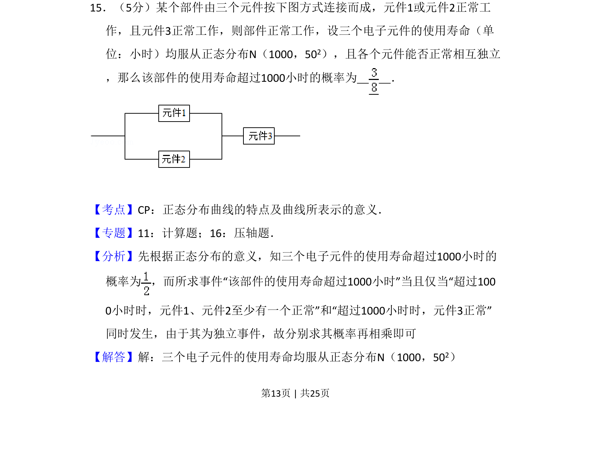
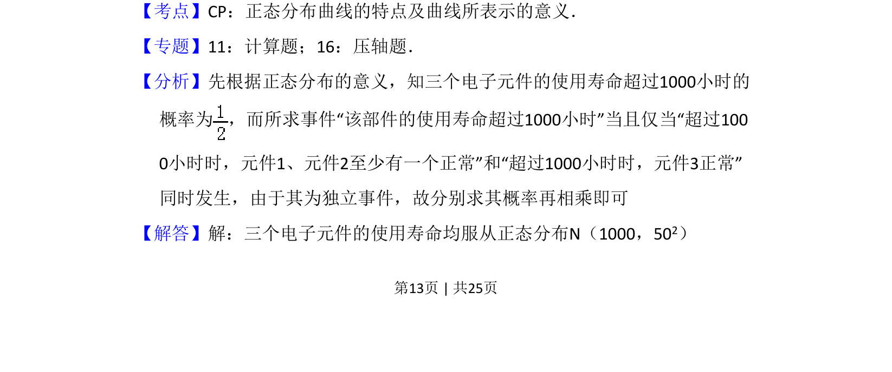
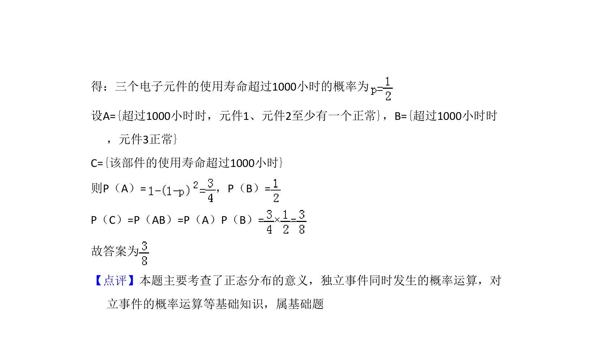

## 题面

## 摘要

求部件正常工作概率，涉及正态分布对称性、元件正常工作的概率及独立事件同时发生的计算

## 关联考点

- [[496-正态分布概念|正态分布]]
- [[468-事件相互独立性-高中|相互独立事件]]
- [[概率乘法公式]]
- [[并联系统可靠性]]

## 答案与解析

> 📄 原 PDF 第 13 页：`素材/真题/吉林/2008-2024·（吉林）数学高考真题/2012年高考数学试卷（理）（新课标）（解析卷）.pdf`
