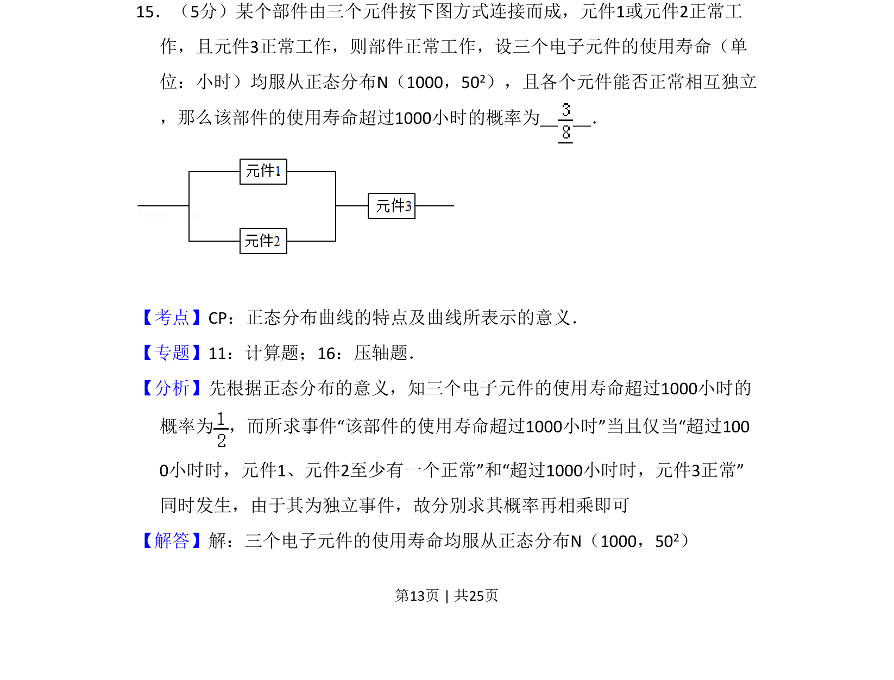
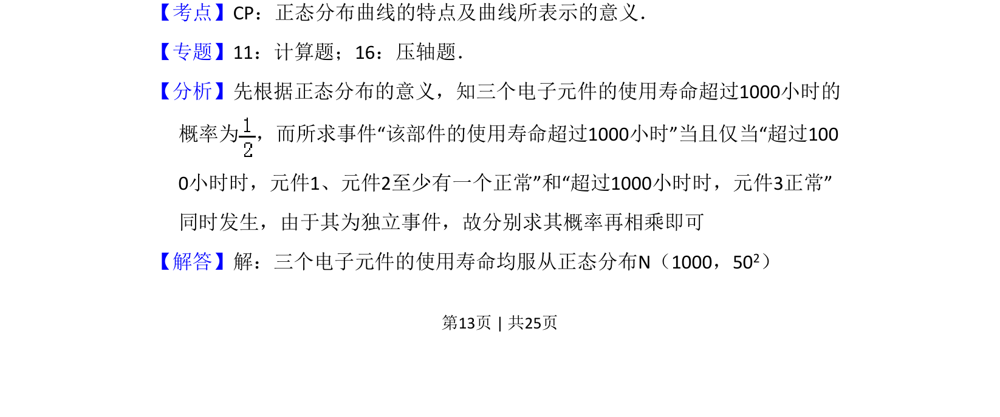
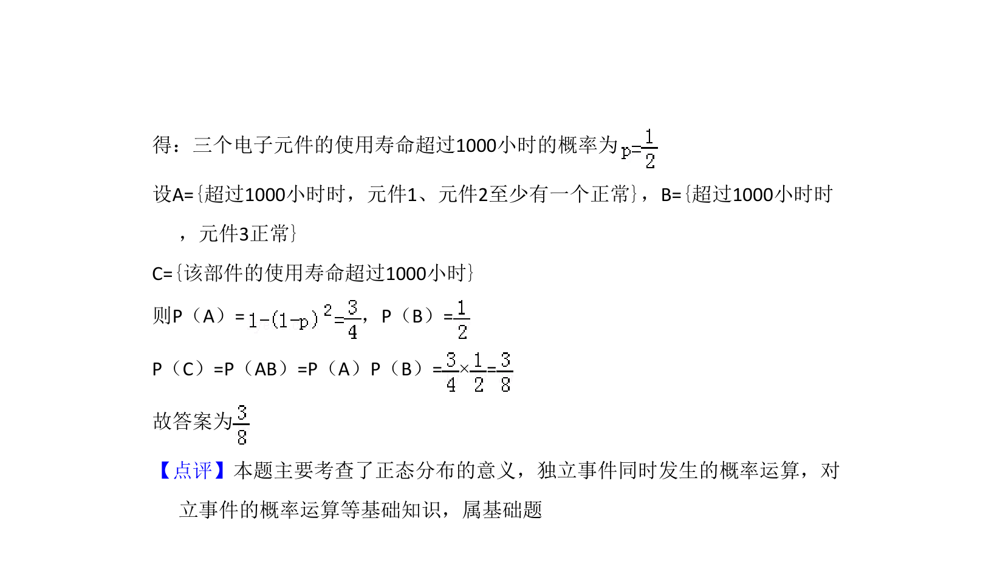

## 题面

## 摘要

求部件正常工作概率，涉及正态分布对称性、元件正常工作的概率及独立事件同时发生的计算

## 关联考点

- [[496-正态分布概念|正态分布]]
- [[468-事件相互独立性-高中|相互独立事件]]
- [[946-概率乘法公式|概率乘法公式]]
- [[1185-并联系统可靠性|并联系统可靠性]]

## 答案与解析

> 📄 原 PDF 第 13 页：`素材/真题/吉林/2008-2024·（吉林）数学高考真题/2012年高考数学试卷（理）（新课标）（解析卷）.pdf`

<!-- 题干文本-start -->
## 题干文本
15．（5分）某个部件由三个元件按下图方式连接而成，元件1或元件2正常工
作，且元件3正常工作，则部件正常工作，设三个电子元件的使用寿命（单
位：小时）均服从正态分布N（1000，502），且各个元件能否正常相互独立
，那么该部件的使用寿命超过1000小时的概率为　 　．
<!-- 题干文本-end -->

<!-- 解析文本-start -->
## 解析文本
【考点】CP：正态分布曲线的特点及曲线所表示的意义．菁优网版权所有
【专题】11：计算题；16：压轴题．
【分析】先根据正态分布的意义，知三个电子元件的使用寿命超过1000小时的
概率为 ，而所求事件“该部件的使用寿命超过1000小时”当且仅当“超过100
0小时时，元件1、元件2至少有一个正常”和“超过1000小时时，元件3正常”
同时发生，由于其为独立事件，故分别求其概率再相乘即可
【解答】解：三个电子元件的使用寿命均服从正态分布N（1000，502）
<!-- 解析文本-end -->
