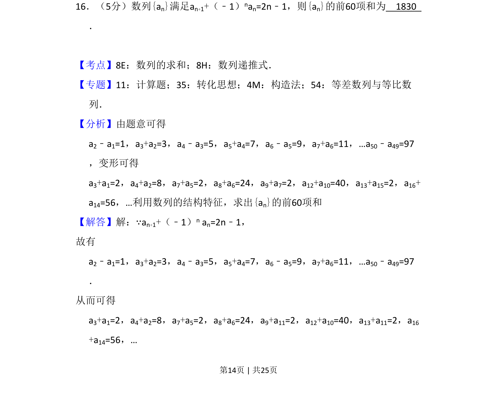
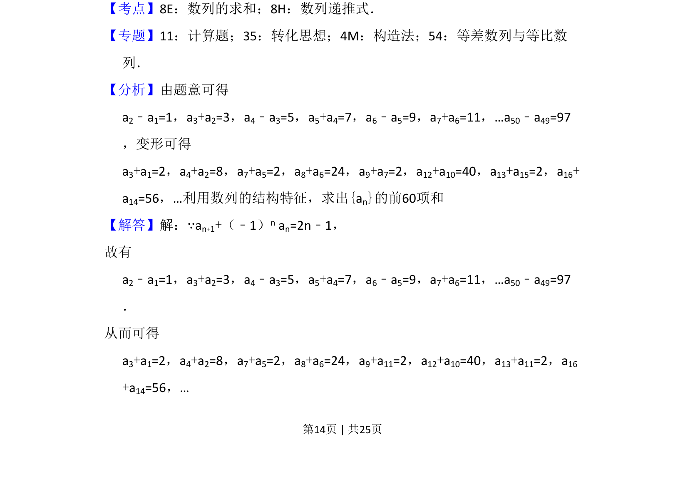
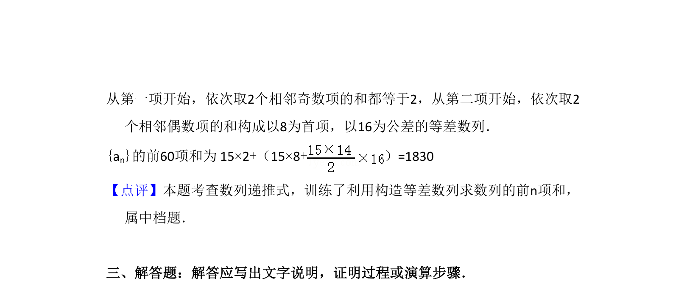

## 题面

## 摘要

根据奇偶项递推关系，通过分组构造求数列前60项和。

## 关联考点

- [[894-数列递推式|数列递推式]]
- [[1081-累加求和|数列求和]]
- [[925-构造法|构造法]]

## 答案与解析

> 📄 原 PDF 第 14 页：`素材/真题/吉林/2008-2024·（吉林）数学高考真题/2012年高考数学试卷（理）（新课标）（解析卷）.pdf`

<!-- 题干文本-start -->
## 题干文本
16．（5分）数列{an}满足an+1+（﹣1）nan=2n﹣1，则{an}的前60项和为　1830　
．
<!-- 题干文本-end -->

<!-- 解析文本-start -->
## 解析文本
【考点】8E：数列的求和；8H：数列递推式．菁优网版权所有
【专题】11：计算题；35：转化思想；4M：构造法；54：等差数列与等比数
列．
【分析】由题意可得 
a2﹣a1=1，a3+a2=3，a4﹣a3=5，a5+a4=7，a6﹣a5=9，a7+a6=11，…a50﹣a49=97
，变形可得 
a3+a1=2，a4+a2=8，a7+a5=2，a8+a6=24，a9+a7=2，a12+a10=40，a13+a15=2，a16+
a14=56，…利用数列的结构特征，求出{an}的前60项和
【解答】解：∵an+1+（﹣1）n an=2n﹣1，
故有 
a2﹣a1=1，a3+a2=3，a4﹣a3=5，a5+a4=7，a6﹣a5=9，a7+a6=11，…a50﹣a49=97
．
从而可得 
a3+a1=2，a4+a2=8，a7+a5=2，a8+a6=24，a9+a11=2，a12+a10=40，a13+a11=2，a16
+a14=56，…
<!-- 解析文本-end -->
